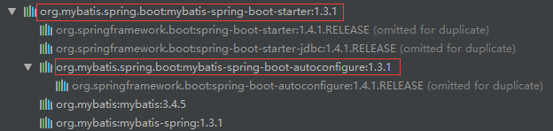

# SpringBoot整合Mybatis源码分析

​	在【Spring Boot】（23）、Spring Boot整合Mybatis的章节中讲述了SpringBoot整合Mybatis的过程，以及一些配置说明，这节主要讲解一下整合的源码。


	废话不多说，直接进入今天的主题。


	阅读过我之前写的文章的童靴，肯定知道SpringBoot整合第三方技术的时候，都会有一个xxxAutoConfiguration的自动配置类，咱们来一起找找看。其实在项目整合Mybatis的时候，需要依赖**mybatis-spring-boot-starter**包：

```xml
<dependency>
    <groupId>org.mybatis.spring.boot</groupId>
    <artifactId>mybatis-spring-boot-starter</artifactId>
    <version>${mybatis.springboot.version}</version>
</dependency>
```

	依赖情况如下：



	在**mybatis-spring-boot-autoconfigure-xxx.jar**包中可以找到**META-INF/spring.factories**的文件，打开后可以看到里面的自动配置类：

```properties
# Auto Configure
org.springframework.boot.autoconfigure.EnableAutoConfiguration=\
org.mybatis.spring.boot.autoconfigure.MybatisAutoConfiguration
```

	

	因此进入**MybatisAutoConfiguration**配置类中：

```java
@org.springframework.context.annotation.Configuration
@ConditionalOnClass({ SqlSessionFactory.class, SqlSessionFactoryBean.class })
@ConditionalOnBean(DataSource.class)
@EnableConfigurationProperties(MybatisProperties.class)
@AutoConfigureAfter(DataSourceAutoConfiguration.class)
public class MybatisAutoConfiguration {
    private static final Logger logger = LoggerFactory.getLogger(MybatisAutoConfiguration.class);

    private final MybatisProperties properties;

    private final Interceptor[] interceptors;

    private final ResourceLoader resourceLoader;

    private final DatabaseIdProvider databaseIdProvider;

    private final List<ConfigurationCustomizer> configurationCustomizers;

    public MybatisAutoConfiguration(MybatisProperties properties,
                                    ObjectProvider<Interceptor[]> interceptorsProvider,
                                    ResourceLoader resourceLoader,
                                    ObjectProvider<DatabaseIdProvider> databaseIdProvider,
                                    ObjectProvider<List<ConfigurationCustomizer>> configurationCustomizersProvider) {
        this.properties = properties;
        this.interceptors = interceptorsProvider.getIfAvailable();
        this.resourceLoader = resourceLoader;
        this.databaseIdProvider = databaseIdProvider.getIfAvailable();
        this.configurationCustomizers = configurationCustomizersProvider.getIfAvailable();
    }

    @PostConstruct
    //在构造函数之后，初始化之前，加载mybatis的配置文件
    public void checkConfigFileExists() {
        if (this.properties.isCheckConfigLocation() && StringUtils.hasText(this.properties.getConfigLocation())) {
            Resource resource = this.resourceLoader.getResource(this.properties.getConfigLocation());
            Assert.state(resource.exists(), "Cannot find config location: " + resource
                    + " (please add config file or check your Mybatis configuration)");
        }
    }

    @Bean
    @ConditionalOnMissingBean
    public SqlSessionFactory sqlSessionFactory(DataSource dataSource) throws Exception {
        SqlSessionFactoryBean factory = new SqlSessionFactoryBean();
        factory.setDataSource(dataSource);
        factory.setVfs(SpringBootVFS.class);
        if (StringUtils.hasText(this.properties.getConfigLocation())) {
            factory.setConfigLocation(this.resourceLoader.getResource(this.properties.getConfigLocation()));
        }
        Configuration configuration = this.properties.getConfiguration();
        if (configuration == null && !StringUtils.hasText(this.properties.getConfigLocation())) {
            configuration = new Configuration();
        }
        if (configuration != null && !CollectionUtils.isEmpty(this.configurationCustomizers)) {
            for (ConfigurationCustomizer customizer : this.configurationCustomizers) {
                customizer.customize(configuration);
            }
        }
        factory.setConfiguration(configuration);
        if (this.properties.getConfigurationProperties() != null) {
            factory.setConfigurationProperties(this.properties.getConfigurationProperties());
        }
        if (!ObjectUtils.isEmpty(this.interceptors)) {
            factory.setPlugins(this.interceptors);
        }
        if (this.databaseIdProvider != null) {
            factory.setDatabaseIdProvider(this.databaseIdProvider);
        }
        if (StringUtils.hasLength(this.properties.getTypeAliasesPackage())) {
            factory.setTypeAliasesPackage(this.properties.getTypeAliasesPackage());
        }
        if (StringUtils.hasLength(this.properties.getTypeHandlersPackage())) {
            factory.setTypeHandlersPackage(this.properties.getTypeHandlersPackage());
        }
        if (!ObjectUtils.isEmpty(this.properties.resolveMapperLocations())) {
            factory.setMapperLocations(this.properties.resolveMapperLocations());
        }

        return factory.getObject();
    }

    @Bean
    @ConditionalOnMissingBean
    public SqlSessionTemplate sqlSessionTemplate(SqlSessionFactory sqlSessionFactory) {
        ExecutorType executorType = this.properties.getExecutorType();
        if (executorType != null) {
            return new SqlSessionTemplate(sqlSessionFactory, executorType);
        } else {
            return new SqlSessionTemplate(sqlSessionFactory);
        }
    }
    
    //other code...
}
```

	

	在自动配置的时候会导入一个Properties配置类**MybatisProperties**，咱们来看一下，

```java
@ConfigurationProperties(prefix = MybatisProperties.MYBATIS_PREFIX)
public class MybatisProperties {

    public static final String MYBATIS_PREFIX = "mybatis";

    /**
     * Location of MyBatis xml config file.
     */
    private String configLocation;

    /**
     * Locations of MyBatis mapper files.
     */
    private String[] mapperLocations;

    /**
     * Packages to search type aliases. (Package delimiters are ",; \t\n")
     */
    private String typeAliasesPackage;

    /**
     * Packages to search for type handlers. (Package delimiters are ",; \t\n")
     */
    private String typeHandlersPackage;

    /**
     * Indicates whether perform presence check of the MyBatis xml config file.
     */
    private boolean checkConfigLocation = false;

    /**
     * Execution mode for {@link org.mybatis.spring.SqlSessionTemplate}.
     */
    private ExecutorType executorType;

    /**
     * Externalized properties for MyBatis configuration.
     */
    private Properties configurationProperties;

    /**
     * A Configuration object for customize default settings. If {@link #configLocation}
     * is specified, this property is not used.
     */
    @NestedConfigurationProperty
    private Configuration configuration;

    //other code...
}
```

	该Properties配置类作用主要用于与yml/properties中以mybatis开头的属性进行一一对应，略过。


	在**MybatisAutoConfiguration**自动配置类中，SpringBoot默认自动配置了两个Bean，分别是**SqlSessionFactory**和**SqlSessionTemplate**。**SqlSessionFactory**主要是将Properties配置类中的属性赋值到**SqlSessionFactoryBean**中，类似以前xml中配置的**SqlSessionFactory**:

```xml
<bean id="sqlSessionFactory" class="org.mybatis.spring.SqlSessionFactoryBean">
        <property name="dataSource" ref="dataSource"></property>
        <!-- 自动扫描mapping.xml文件 -->
        <property name="mapperLocations" value="classpath:com/cn/mapper/*.xml"></property>
    	...
</bean>
```

	在创建**SqlSessionFactory**的Bean中，有段代码：

```java
if (configuration != null && !CollectionUtils.isEmpty(this.configurationCustomizers)) {
    for (ConfigurationCustomizer customizer : this.configurationCustomizers) {
        customizer.customize(configuration);
    }
}
```

	在【Spring Boot】（23）、Spring Boot整合Mybatis的章节中也讲述了，通过实现Mybatis中的**ConfigurationCustomizer**接口，重写**customize**方法，达到==覆盖Mybatis中的默认配置项==的功能。

```java
public interface ConfigurationCustomizer {
  	void customize(Configuration configuration);
}
```

	参数**Configuration**即为Mybatis的配置项：

```java
public class Configuration {

    protected Environment environment;

    protected boolean safeRowBoundsEnabled;
    protected boolean safeResultHandlerEnabled = true;
    protected boolean mapUnderscoreToCamelCase;
    protected boolean aggressiveLazyLoading;
    protected boolean multipleResultSetsEnabled = true;
    protected boolean useGeneratedKeys;
    protected boolean useColumnLabel = true;
    protected boolean cacheEnabled = true;
    protected boolean callSettersOnNulls;
    protected boolean useActualParamName = true;
    protected boolean returnInstanceForEmptyRow;

    protected String logPrefix;
    protected Class <? extends Log> logImpl;
    protected Class <? extends VFS> vfsImpl;
    protected LocalCacheScope localCacheScope = LocalCacheScope.SESSION;
    protected JdbcType jdbcTypeForNull = JdbcType.OTHER;
    protected Set<String> lazyLoadTriggerMethods = new HashSet<String>(Arrays.asList(new String[] { "equals", "clone", "hashCode", "toString" }));
    protected Integer defaultStatementTimeout;
    protected Integer defaultFetchSize;
    protected ExecutorType defaultExecutorType = ExecutorType.SIMPLE;
    protected AutoMappingBehavior autoMappingBehavior = AutoMappingBehavior.PARTIAL;
    protected AutoMappingUnknownColumnBehavior autoMappingUnknownColumnBehavior = AutoMappingUnknownColumnBehavior.NONE;

    protected Properties variables = new Properties();
    protected ReflectorFactory reflectorFactory = new DefaultReflectorFactory();
    protected ObjectFactory objectFactory = new DefaultObjectFactory();
    protected ObjectWrapperFactory objectWrapperFactory = new DefaultObjectWrapperFactory();

    protected boolean lazyLoadingEnabled = false;
    protected ProxyFactory proxyFactory = new JavassistProxyFactory(); // #224 Using internal Javassist instead of OGNL

    protected String databaseId;
    /**
     * Configuration factory class.
     * Used to create Configuration for loading deserialized unread properties.
     *
     * @see <a href='https://code.google.com/p/mybatis/issues/detail?id=300'>Issue 300 (google code)</a>
     */
    protected Class<?> configurationFactory;

    protected final MapperRegistry mapperRegistry = new MapperRegistry(this);
    protected final InterceptorChain interceptorChain = new InterceptorChain();
    protected final TypeHandlerRegistry typeHandlerRegistry = new TypeHandlerRegistry();
    protected final TypeAliasRegistry typeAliasRegistry = new TypeAliasRegistry();
    protected final LanguageDriverRegistry languageRegistry = new LanguageDriverRegistry();

    protected final Map<String, MappedStatement> mappedStatements = new StrictMap<MappedStatement>("Mapped Statements collection");
    protected final Map<String, Cache> caches = new StrictMap<Cache>("Caches collection");
    protected final Map<String, ResultMap> resultMaps = new StrictMap<ResultMap>("Result Maps collection");
    protected final Map<String, ParameterMap> parameterMaps = new StrictMap<ParameterMap>("Parameter Maps collection");
    protected final Map<String, KeyGenerator> keyGenerators = new StrictMap<KeyGenerator>("Key Generators collection");

    protected final Set<String> loadedResources = new HashSet<String>();
    protected final Map<String, XNode> sqlFragments = new StrictMap<XNode>("XML fragments parsed from previous mappers");

    protected final Collection<XMLStatementBuilder> incompleteStatements = new LinkedList<XMLStatementBuilder>();
    protected final Collection<CacheRefResolver> incompleteCacheRefs = new LinkedList<CacheRefResolver>();
    protected final Collection<ResultMapResolver> incompleteResultMaps = new LinkedList<ResultMapResolver>();
    protected final Collection<MethodResolver> incompleteMethods = new LinkedList<MethodResolver>();

    //other code...
}
```

	具体可以看看【Spring Boot】（23）、Spring Boot整合Mybatis中的使用方式，在此就不在讲解了。


	另外一个Bean为**SqlSessionTemplate**，通过**SqlSessionFactory**来生成**SqlSession**代理类：

```java
public class SqlSessionTemplate implements SqlSession, DisposableBean {

  	private final SqlSessionFactory sqlSessionFactory;

  	private final ExecutorType executorType;

  	private final SqlSession sqlSessionProxy;

  	private final PersistenceExceptionTranslator exceptionTranslator;

    //other code...
    
    public SqlSessionTemplate(SqlSessionFactory sqlSessionFactory, ExecutorType executorType,
          PersistenceExceptionTranslator exceptionTranslator) {

        notNull(sqlSessionFactory, "Property 'sqlSessionFactory' is required");
        notNull(executorType, "Property 'executorType' is required");

        this.sqlSessionFactory = sqlSessionFactory;
        this.executorType = executorType;
        this.exceptionTranslator = exceptionTranslator;
        
        //生成SqlSessioin代理类
        this.sqlSessionProxy = (SqlSession) newProxyInstance(
            SqlSessionFactory.class.getClassLoader(),
            new Class[] { SqlSession.class },
            new SqlSessionInterceptor());
    }
}
```


	在**MybatisAutoConfiguration**自动配置类中，有个静态内部类 **AutoConfiguredMapperScannerRegistrar** 

```java
public static class AutoConfiguredMapperScannerRegistrar
            implements BeanFactoryAware, ImportBeanDefinitionRegistrar, ResourceLoaderAware {

    private BeanFactory beanFactory;

    private ResourceLoader resourceLoader;

    @Override
    public void registerBeanDefinitions(AnnotationMetadata importingClassMetadata, BeanDefinitionRegistry registry) {

        logger.debug("Searching for mappers annotated with @Mapper");

        ClassPathMapperScanner scanner = new ClassPathMapperScanner(registry);

        try {
            if (this.resourceLoader != null) {
                scanner.setResourceLoader(this.resourceLoader);
            }

            List<String> packages = AutoConfigurationPackages.get(this.beanFactory);
            if (logger.isDebugEnabled()) {
                for (String pkg : packages) {
                    logger.debug("Using auto-configuration base package '{}'", pkg);
                }
            }

            //添加@Mapper注解
            scanner.setAnnotationClass(Mapper.class);
            scanner.registerFilters();
            //进行包扫描，加载添加@Mapper注解的类
            scanner.doScan(StringUtils.toStringArray(packages));
        } catch (IllegalStateException ex) {
            logger.debug("Could not determine auto-configuration package, automatic mapper scanning disabled.", ex);
        }
    }

    @Override
    public void setBeanFactory(BeanFactory beanFactory) throws BeansException {
        this.beanFactory = beanFactory;
    }

    @Override
    public void setResourceLoader(ResourceLoader resourceLoader) {
        this.resourceLoader = resourceLoader;
    }
}

@org.springframework.context.annotation.Configuration
@Import({ AutoConfiguredMapperScannerRegistrar.class })
@ConditionalOnMissingBean(MapperFactoryBean.class)
public static class MapperScannerRegistrarNotFoundConfiguration {

    @PostConstruct
    public void afterPropertiesSet() {
        logger.debug("No {} found.", MapperFactoryBean.class.getName());
    }
}
```

	它主要用于扫描带有@Mapper注解的mapper接口，暂时先不讲这个内部类，后面再讲。


	咱们先来讲下Mybatis的**MapperScannerRegistrar**，它的功能同上述功能刚好相反。学过SpringBoot整合Mybatis的童靴，肯定知道一个注解**@MapperScan**，来看看它的签名：

```java
@Retention(RetentionPolicy.RUNTIME)
@Target(ElementType.TYPE)
@Documented
@Import(MapperScannerRegistrar.class)
public @interface MapperScan {
    //other code...
}
```

	可以看到，如果使用了**@MapperScan**注解，则项目会导入**MapperScannerRegistrar**：

```java
public class MapperScannerRegistrar implements ImportBeanDefinitionRegistrar, ResourceLoaderAware {

    private ResourceLoader resourceLoader;

    @Override
    public void registerBeanDefinitions(AnnotationMetadata importingClassMetadata, BeanDefinitionRegistry registry) {

        AnnotationAttributes annoAttrs = AnnotationAttributes.fromMap(importingClassMetadata.getAnnotationAttributes(MapperScan.class.getName()));
        ClassPathMapperScanner scanner = new ClassPathMapperScanner(registry);

        // this check is needed in Spring 3.1
        if (resourceLoader != null) {
            scanner.setResourceLoader(resourceLoader);
        }

        Class<? extends Annotation> annotationClass = annoAttrs.getClass("annotationClass");
        if (!Annotation.class.equals(annotationClass)) {
            scanner.setAnnotationClass(annotationClass);
        }

        Class<?> markerInterface = annoAttrs.getClass("markerInterface");
        if (!Class.class.equals(markerInterface)) {
            scanner.setMarkerInterface(markerInterface);
        }

        Class<? extends BeanNameGenerator> generatorClass = annoAttrs.getClass("nameGenerator");
        if (!BeanNameGenerator.class.equals(generatorClass)) {
            scanner.setBeanNameGenerator(BeanUtils.instantiateClass(generatorClass));
        }

        Class<? extends MapperFactoryBean> mapperFactoryBeanClass = annoAttrs.getClass("factoryBean");
        if (!MapperFactoryBean.class.equals(mapperFactoryBeanClass)) {
            scanner.setMapperFactoryBean(BeanUtils.instantiateClass(mapperFactoryBeanClass));
        }

        scanner.setSqlSessionTemplateBeanName(annoAttrs.getString("sqlSessionTemplateRef"));
        scanner.setSqlSessionFactoryBeanName(annoAttrs.getString("sqlSessionFactoryRef"));

        List<String> basePackages = new ArrayList<String>();
        //解析@MapperScan的属性
        for (String pkg : annoAttrs.getStringArray("value")) {
            if (StringUtils.hasText(pkg)) {
                basePackages.add(pkg);
            }
        }
        for (String pkg : annoAttrs.getStringArray("basePackages")) {
            if (StringUtils.hasText(pkg)) {
                basePackages.add(pkg);
            }
        }
        for (Class<?> clazz : annoAttrs.getClassArray("basePackageClasses")) {
            basePackages.add(ClassUtils.getPackageName(clazz));
        }
        scanner.registerFilters();
        //进行包扫描
        scanner.doScan(StringUtils.toStringArray(basePackages));
    }

    @Override
    public void setResourceLoader(ResourceLoader resourceLoader) {
        this.resourceLoader = resourceLoader;
    }

}
```

	一旦使用**@MapperScan**注解，则回在**MapperScannerRegistrar#registerBeanDefinitions**方法中会解析**@MapperScan**注解的属性，加载basePackages，并进行包扫描，调用==doScan==方法。

```java
public class ClassPathMapperScanner extends ClassPathBeanDefinitionScanner {
    //other code...
    
    private MapperFactoryBean<?> mapperFactoryBean = new MapperFactoryBean<Object>();
    
    @Override
    public Set<BeanDefinitionHolder> doScan(String... basePackages) {
        //调用父类的doScan方法
        Set<BeanDefinitionHolder> beanDefinitions = super.doScan(basePackages);

        if (beanDefinitions.isEmpty()) {
            logger.warn("No MyBatis mapper was found in '" + Arrays.toString(basePackages) + "' package. Please check your configuration.");
        } else {
            //进行Bean定义
            processBeanDefinitions(beanDefinitions);
        }

        return beanDefinitions;
    }

    private void processBeanDefinitions(Set<BeanDefinitionHolder> beanDefinitions) {
        GenericBeanDefinition definition;
        for (BeanDefinitionHolder holder : beanDefinitions) {
            definition = (GenericBeanDefinition) holder.getBeanDefinition();

            if (logger.isDebugEnabled()) {
                logger.debug("Creating MapperFactoryBean with name '" + holder.getBeanName()
                        + "' and '" + definition.getBeanClassName() + "' mapperInterface");
            }

            // the mapper interface is the original class of the bean
            // but, the actual class of the bean is MapperFactoryBean
            definition.getConstructorArgumentValues().addGenericArgumentValue(definition.getBeanClassName()); 
            //将@MapperScan扫描进来的Mapper接口的class设置为MapperFactoryBean的class
            definition.setBeanClass(this.mapperFactoryBean.getClass());

            definition.getPropertyValues().add("addToConfig", this.addToConfig);

            boolean explicitFactoryUsed = false;
            if (StringUtils.hasText(this.sqlSessionFactoryBeanName)) {
                definition.getPropertyValues().add("sqlSessionFactory", new RuntimeBeanReference(this.sqlSessionFactoryBeanName));
                explicitFactoryUsed = true;
            } else if (this.sqlSessionFactory != null) {
                definition.getPropertyValues().add("sqlSessionFactory", this.sqlSessionFactory);
                explicitFactoryUsed = true;
            }

            if (StringUtils.hasText(this.sqlSessionTemplateBeanName)) {
                if (explicitFactoryUsed) {
                    logger.warn("Cannot use both: sqlSessionTemplate and sqlSessionFactory together. sqlSessionFactory is ignored.");
                }
                definition.getPropertyValues().add("sqlSessionTemplate", new RuntimeBeanReference(this.sqlSessionTemplateBeanName));
                explicitFactoryUsed = true;
            } else if (this.sqlSessionTemplate != null) {
                if (explicitFactoryUsed) {
                    logger.warn("Cannot use both: sqlSessionTemplate and sqlSessionFactory together. sqlSessionFactory is ignored.");
                }
                definition.getPropertyValues().add("sqlSessionTemplate", this.sqlSessionTemplate);
                explicitFactoryUsed = true;
            }

            if (!explicitFactoryUsed) {
                if (logger.isDebugEnabled()) {
                    logger.debug("Enabling autowire by type for MapperFactoryBean with name '" + holder.getBeanName() + "'.");
                }
                definition.setAutowireMode(AbstractBeanDefinition.AUTOWIRE_BY_TYPE);
            }
        }
    }
}
```

**==重点代码：==**

```java
definition.setBeanClass(this.mapperFactoryBean.getClass());
```

​	==**从这句代码可以看到，在MapperScannerRegistrar中，把@MapperScan包扫描进来的Mapper接口的class设置成来MapperFactoryBean的class，所以使用@MapperScan注解的话，在容器中就存在MapperFactoryBean这个类型的Bean，从而导致MapperScannerRegistrarNotFoundConfiguration配置类不生效，原因就是类签名上有个注解@ConditionalOnMissingBean(MapperFactoryBean.class)。**==


​	既然如果使用了**@MapperScan**注解会导致**AutoConfiguredMapperScannerRegistrar(MapperScannerRegistrarNotFoundConfiguration)**不生效，那么只要去掉**@MapperScan**注解，自然就会进入**AutoConfiguredMapperScannerRegistrar**这个导入类了，重点来了：

```java
//默认为Application主类所在的包及其子包
List<String> packages = AutoConfigurationPackages.get(this.beanFactory);
//设置扫描器的扫描类类型，带有@Mapper注解的类
scanner.setAnnotationClass(Mapper.class);
scanner.registerFilters();
//进行包扫描
scanner.doScan(StringUtils.toStringArray(packages));
```

​	

​	最后Mybatis的CRUD操作都是通过**SqlSessionTemplate**这个代理实例进行操作。