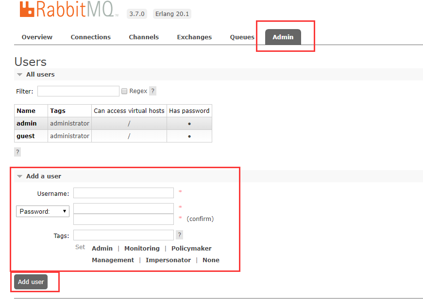
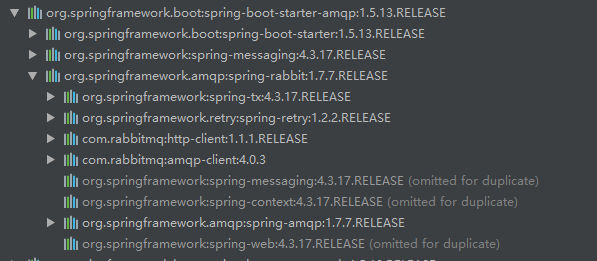
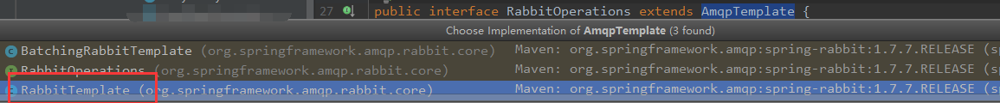
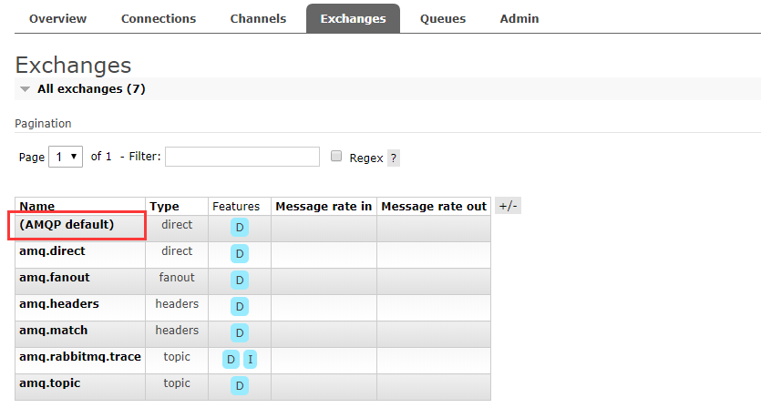
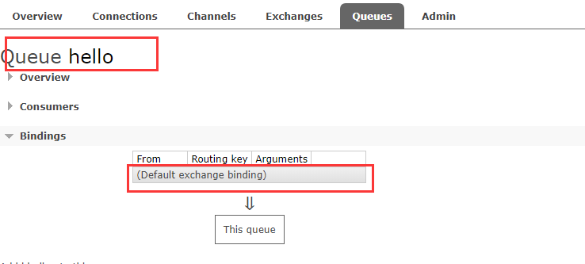
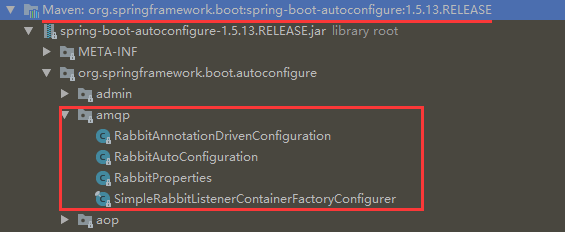
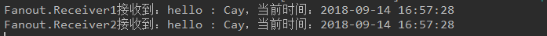
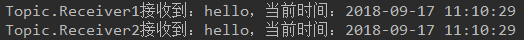

## 1、安装
### 1.1、Erlang： 

[Erlang下载地址](http://www.erlang.org/downloads)，下载后安装即可。

### 1.2、RabbitMQ安装

[RabbitMQ下载地址](https://www.rabbitmq.com/download.html)，下载后安装即可。

==注意：Erlang的版本要与RabbitMQ版本需要匹配才行。==

|                           RabbitMQ                           | Minimum required Erlang/OTP | Maximum supported Erlang/OTP |
| :----------------------------------------------------------: | :-------------------------: | :--------------------------: |
|                          **3.7.x**                           |          **19.3**           |          **20.3.x**          |
|                            3.6.15                            |            19.3             |            20.3.x            |
|             3.6.14、  3.6.13 、 3.6.12、  3.6.11             |           R16B03            |            20.1.x            |
| 3.6.10 、 3.6.9、  3.6.8、  3.6.7、  3.6.6、  3.6.5、  3.6.4 |           R16B03            |            19.3.x            |
|               3.6.3 、 3.6.2、  3.6.1、  3.6.0               |           R16B03            |            18.3.x            |
|                            3.5.x                             |           R14B04            |            17.5.x            |
|                            3.4.x                             |           R13B03            |            16B03             |


## 2、可视化管理界面
* Erlang和RabbitMQ安装完成后，通过命令行进入到RabbitMQ的安装目录下的sbin目录，输入以下命令，等待返回。

  * ==**rabbitmq-plugins enable rabbitmq_management**==

* 访问http://ip:15672/, 使用guest/guest或者admin/admin登录。

* **==如果使用的是Linux系统，记得把防火墙的端口15672开放或者把防火墙关闭。==**

* 如果代码中需要使用新用户作为测试，需要在`Admin`标签页中新建一个用户，并同时设置密码和`virtual hosts`。

  


## 3、RabbitMQ术语

* **Server(Broker)：**接收客户端连接，实现AMQP协议的消息队列和路由功能的进程；
* **Virtual Host：**虚拟主机的概念，类似权限控制组，一个Virtual Host里可以有多个Exchange和Queue,权限控制的最小丽都是Virtual Host；
* **Exchange：**交换机，接收生产者发送的消息，并根据Routing Key将消息路由到服务器中的队列Queue。
* **ExchangeType：**交换机类型决定了路由消息行为，RabbitMQ中主要有三种类型Exchange，分别是fanout、direct、topic；
* **Message Queue：**消息队列，用于存储还未被消费者消费的消息；
* **Message：**由Header和body组成，Header是由生产者添加的各种属性的集合，包括Message是否被持久化、优先级是多少、由哪个Message Queue接收等；body是真正需要发送的数据内容；
* **BindingKey（RouteKey）：**绑定关键字，将一个特定的Exchange和一个特定的Queue绑定起来。


## 4、与Spring Boot的整合（简单版HelloWorld）

### 4.1、引入RabbitMQ依赖

首先当然是添加RabbitMQ的依赖啦，从mvn repository找到SpringBoot整合RabbitMQ的整合包。

```xml
<dependency>
    <groupId>org.springframework.boot</groupId>
    <artifactId>spring-boot-starter-amqp</artifactId>
    <version>${spring-boot-amqp.version}</version>
</dependency>
```

来看看其依赖情况：




### 4.2、添加RabbitMQ配置信息

```properties
spring.rabbitmq.host=ip地址
spring.rabbitmq.port=5672
spring.rabbitmq.username=用户名
spring.rabbitmq.password=密码
spring.rabbitmq.virtual-host=/
spring.rabbitmq.publisher-confirms=true
```

这里配置的信息是最基础的，复杂的配置可以自行百度尝试。


### 4.3、创建消息生产者

>  通过注入`AmqpTemplate`接口的实例来实现消息的发送，`AmqpTemplate`接口定义了一套针对AMQP协议的基础操作。在Spring Boot中会根据配置来注入其具体实现。

```java
@Component
public class Sender {

	@Autowired
	private AmqpTemplate amqpTemplate;

	public void send(){
		String content = "hello : " + LocalDateTime.now().format(DateTimeFormatter.ofPattern("yyyy-MM-dd HH:mm:ss"));

		amqpTemplate.convertAndSend("hello", content);
	}
}
```

此时的**AmqpTemplate**对象其实是**RabbitTemplate**的实例，因为**RabbitTemplate**是**AmqpTemplate**的子类:



至于为啥能自动注入这个Bean，后面会讲解到，先不急。


### 4.4、创建消息消费者

>  通过`@RabbitListener`注解定义该类对`hello`队列的监听，并用`@RabbitHandler`注解来指定对消息的处理方法。所以，该消费者实现了对`hello`队列的消费，消费操作为输出消息的字符串内容。

```java
@RabbitListener(queues = {"hello"})
@Component
public class Receiver {

	@RabbitHandler
	public void handler(String content){
		System.out.println("接收到：" + content);
	}
}
```


### 4.5、创建RabbitMQ配置类

> 用来配置队列、交换器、路由等高级信息。

```java
@Configuration
public class RabbitConfig {

	@Bean
	public Queue helloQueue(){
		return new Queue("hello");
	}
}
```


### 4.6、编写测试类

> 注入消息生产者用于向队列中发送消息

```java
@SpringBootTest
@RunWith(SpringRunner.class)
public class TestRabbitmq {

	@Autowired
	private Sender sender;

	@Test
	public void test(){
		sender.send();
	}
}
```


### 4.7、测试

* 先启动主程序类，用于监听队列；
* 然后运行测试类，使用生产者向队列中发送消息。


### 4.8 、疑问

学过RabbitMQ基础的童靴肯定知道，要通过RabbitMQ发送消息的话，需要创建通道，交换机，队列，并将通道与交换机、交换机与队列绑定起来，而上述的简单例子中，为什么没看到通道、交换机的创建，也没看到绑定的操作呢？其实在RabbitMQ中，在不创建交换机的情况下，RabbitMQ会创建一个默认的交换机，通过RabbitMQ可视化管理界面可以看到：



而且创建的队列，默认也就绑定到该交换机上，见下图：



再仔细看这个默认交换机，能看到这个交换机(Exchange)类型是Direct模式的，至于什么是Direct模式，后面会讲。


## 5、Spring Boot自动配置RabbitMQ

同之前文章一样，SpringBoot整合RabbitMQ同样有个自动配置类，只不过RabbitMQ的自动配置类是由SpringBoot官方自行提供，而不像Mybatis是由Mybatis方提供的。这个自动配置类在spring-boot-autoconfigure-xxx.jar包中:




这里说个题外话，是关于自定义Starter的小知识点：

* 启动器(Starter)只用来做依赖导入；
* 需要专门写一个自动配置模块；
* 启动器依赖自动配置模块，使用的时候只需要引入启动器(Starter);

而在命名规范中约定如下：

* 官方命名空间：
  * 前缀：spring-boot-starter-xxx
  * 模式：spring-boot-starter-模块名
  * 举例：spring-boot-starter-web、spring-boot-starter-jdbc、...
* 自定义命名空间：
  * 前缀：xxx-spring-boot-starter
  * 模式：模块名-spring-boot-starter
  * 举例：mybatis-spring-boot-starter、pagehelper-spring-boot-starter、...


进入正题之前，咱们先来看看Spring与RabbitMQ的整合时的配置信息：

```xml
<!-- RabbitMQ start -->
<!-- 连接配置 -->
<rabbit:connection-factory id="connectionFactory" host="${mq.host}" username="${mq.username}"
                           password="${mq.password}" port="${mq.port}"  />

<rabbit:admin connection-factory="connectionFactory"/>

<!-- 消息队列客户端 -->
<rabbit:template id="amqpTemplate" exchange="${mq.queue}_exchange" connection-factory="connectionFactory"  />

<!-- queue 队列声明 -->
<!-- 
        durable 是否持久化 
        exclusive 仅创建者可以使用的私有队列，断开后自动删除 
        auto-delete 当所有消费端连接断开后，是否自动删除队列 -->
<rabbit:queue id="test_queue" name="${mq.queue}_testQueue" durable="true" auto-delete="false" exclusive="false" />

<!-- Topic交换机定义，其他类型交换机类似 -->
<!-- 
        交换机：一个交换机可以绑定多个队列，一个队列也可以绑定到多个交换机上。
        如果没有队列绑定到交换机上，则发送到该交换机上的信息则会丢失。
     -->
<rabbit:topic-exchange name="${mq.queue}_exchange" durable="true" auto-delete="false">
    <rabbit:bindings>
        <!-- 设置消息Queue匹配的pattern (direct模式为key) -->
        <rabbit:binding queue="test_queue" pattern="${mq.queue}_patt"/>
    </rabbit:bindings>
</rabbit:topic-exchange>

<bean name="rabbitmqService" class="xxx.yyy.zzz"></bean>

<!-- 配置监听 消费者 -->
<rabbit:listener-container connection-factory="connectionFactory" acknowledge="auto">
    <!-- 
            queues 监听队列，多个用逗号分隔 
            ref 监听器 -->
    <rabbit:listener queues="test_queue" ref="rabbitmqService"/>
</rabbit:listener-container>
```

配合上面的xml配置文件来看看SpringBoot中RabbitMQ的自动配置类**RabbitAutoConfiguration**：

```java
@Configuration
@ConditionalOnClass({ RabbitTemplate.class, Channel.class })
@EnableConfigurationProperties(RabbitProperties.class)
@Import(RabbitAnnotationDrivenConfiguration.class)
public class RabbitAutoConfiguration {
    
    @Configuration
	@ConditionalOnMissingBean(ConnectionFactory.class)
	protected static class RabbitConnectionFactoryCreator {
    
        @Bean
        public CachingConnectionFactory rabbitConnectionFactory(RabbitProperties config)
            throws Exception {
            RabbitConnectionFactoryBean factory = new RabbitConnectionFactoryBean();
            //...
            return connectionFactory;
        }
    }
    
    @Configuration
	@Import(RabbitConnectionFactoryCreator.class)
	protected static class RabbitTemplateConfiguration {
        
        @Bean
		@ConditionalOnSingleCandidate(ConnectionFactory.class)
		@ConditionalOnMissingBean(RabbitTemplate.class)
		public RabbitTemplate rabbitTemplate(ConnectionFactory connectionFactory) {
			RabbitTemplate rabbitTemplate = new RabbitTemplate(connectionFactory);
            //...
            return rabbitTemplate;
        }
        
        @Bean
		@ConditionalOnSingleCandidate(ConnectionFactory.class)
		@ConditionalOnProperty(prefix = "spring.rabbitmq", name = "dynamic", matchIfMissing = true)
		@ConditionalOnMissingBean(AmqpAdmin.class)
		public AmqpAdmin amqpAdmin(ConnectionFactory connectionFactory) {
			return new RabbitAdmin(connectionFactory);
		}
    }
}
```

该自动配置类中自动注册了三个重要的Bean，分别是**rabbitConnectionFactory**、**rabbitTemplate**、**amqpAdmin**，刚好与xml配置文件中的前三个Bean一一对应。当然RabbitMQ的配置信息由**RabbitProperties**类进行导入：

```java
@ConfigurationProperties(prefix = "spring.rabbitmq")
public class RabbitProperties {
	private String host = "localhost";
	private int port = 5672;
	private String username;
	private String password;
	private final Ssl ssl = new Ssl();
	private String virtualHost;
	
	private String addresses;
	private Integer requestedHeartbeat;
	private boolean publisherConfirms;
	private boolean publisherReturns;
	private Integer connectionTimeout;
	private final Cache cache = new Cache();
	private final Listener listener = new Listener();
	private final Template template = new Template();
	private List<Address> parsedAddresses;
	
	public static class Ssl {
		private boolean enabled;
		private String keyStore;
		private String keyStorePassword;
		private String trustStore;
		private String trustStorePassword;
		private String algorithm;
	}
	public static class Cache {
		private final Channel channel = new Channel();
		private final Connection connection = new Connection();
        
		public static class Channel {
			private Integer size;
			private Long checkoutTimeout;
		}

		public static class Connection {
			private CacheMode mode = CacheMode.CHANNEL;
			private Integer size;
        }
	}

	public static class Listener {
		@NestedConfigurationProperty
		private final AmqpContainer simple = new AmqpContainer();
	}

	public static class AmqpContainer {
		private boolean autoStartup = true;
		private AcknowledgeMode acknowledgeMode;
		private Integer concurrency;
		private Integer maxConcurrency;
		private Integer prefetch;
		private Integer transactionSize;
		private Boolean defaultRequeueRejected;
		private Long idleEventInterval;
		@NestedConfigurationProperty
		private final ListenerRetry retry = new ListenerRetry();
	}

	public static class Template {
		@NestedConfigurationProperty
		private final Retry retry = new Retry();
		private Boolean mandatory;
		private Long receiveTimeout;
		private Long replyTimeout;
	}

	public static class Retry {
		private boolean enabled;
		private int maxAttempts = 3;
		private long initialInterval = 1000L;
		private double multiplier = 1.0;
		private long maxInterval = 10000L;
	}

	public static class ListenerRetry extends Retry {
		private boolean stateless = true;
	}
	
	private static final class Address {
		private static final String PREFIX_AMQP = "amqp://";
		private static final int DEFAULT_PORT = 5672;
		private String host;
		private int port;
		private String username;
		private String password;
		private String virtualHost;
	}
}
```

大家自行尝试，这里就不多描述了。


在**RabbitAutoConfiguration**配置类上有个签名：

```java
@Import(RabbitAnnotationDrivenConfiguration.class)
```

来看看**RabbitAnnotationDrivenConfiguration**类：

```java
public class SimpleRabbitListenerContainerFactory
		extends AbstractRabbitListenerContainerFactory<SimpleMessageListenerContainer>
		implements ApplicationContextAware, ApplicationEventPublisherAware {

	private Executor taskExecutor;

	private PlatformTransactionManager transactionManager;

	private Integer txSize;

	private Integer concurrentConsumers;

	private Integer maxConcurrentConsumers;

	private Long startConsumerMinInterval;

	private Long stopConsumerMinInterval;

	private Integer consecutiveActiveTrigger;

	private Integer consecutiveIdleTrigger;

	private Integer prefetchCount;

	private Long receiveTimeout;

	private Boolean defaultRequeueRejected;

	private Advice[] adviceChain;

	private BackOff recoveryBackOff;

	private Boolean missingQueuesFatal;

	private Boolean mismatchedQueuesFatal;

	private ConsumerTagStrategy consumerTagStrategy;

	private Long idleEventInterval;

	private ApplicationEventPublisher applicationEventPublisher;

	private ApplicationContext applicationContext;
	
	@Override
	protected SimpleMessageListenerContainer createContainerInstance() {
		return new SimpleMessageListenerContainer();
	}

	@Override
	protected void initializeContainer(SimpleMessageListenerContainer instance) {
		//other code...
	}
}
```

它其实是**SimpleMessageListenerContainer**的工厂类，而**SimpleMessageListenerContainer**又是\<rabbit:listener-container />标签的具体实现类，刚好又同xml配置文件的消费监听容器对应。

至于其他的配置信息，如队列和交换机的创建，以及队列与交换机的绑定就由配置类自行定义了。请往下接着看...


## 6、RabbitMQ交换机及工作模式

RabbitMQ的交换机Exchange有如下几种类型：

* **Fanout**

* **Direct** 

* **Topic** 

* **Header **

其中header类型的Exchange由于用的相对较少，所以本章主要讲述其他三种类型的Exchange。


RabbitMQ的工作模式：

* **发布/订阅模式：**对应**Fanout**类型的交换机。
* **路由模式：**对应**Direct**类型的交换机。
* **通配符模式：**对应**Topic**类型的交换机。


### 6.1、发布/订阅模式（Fanout）

**任何发送到Fanout Exchange的消息都会被转发到与该Exchange绑定(Binding)的所有Queue上。**

* 可以理解为路由表的模式；
* 这种模式不需要RouteKey；
* 这种模式需要提前将Exchange与Queue进行绑定，一个Exchange可以绑定多个Queue，一个Queue可以同多个Exchange进行绑定；
* 如果接受到消息的Exchange没有与任何Queue绑定，则消息会被抛弃。


**代码示例:**

FanoutConfig配置类代码，配置了两个队列和一个交换机，并绑定：

```java
@Configuration
public class FanoutConfig {

    public static final String FANOUT_QUEUE_NAME_1 = "fanout-queue-1";
    public static final String FANOUT_QUEUE_NAME_2 = "fanout-queue-2";
    public static final String FANOUT_EXCHANGE_NAME = "fanout-exchange";

    @Bean
    public Queue fanoutQueue1() {
//        return new Queue(FANOUT_QUEUE_NAME_1);//默认情况，durable为true,exclusive为false,auto-delete为false
        return QueueBuilder.durable(FANOUT_QUEUE_NAME_1).build();
    }

    @Bean
    public Queue fanoutQueue2() {
//        return new Queue(FANOUT_QUEUE_NAME_1);//默认情况，durable为true,exclusive为false,auto-delete为false
        return QueueBuilder.durable(FANOUT_QUEUE_NAME_2).build();
    }

    @Bean
    public FanoutExchange fanoutExchange() {
//        return new FanoutExchange(FANOUT_EXCHANGE_NAME);//默认情况下，durable为true,auto-delete为false
        return (FanoutExchange) ExchangeBuilder.fanoutExchange(FANOUT_EXCHANGE_NAME).durable(true).build();
    }

    @Bean
    public Binding fanoutBinding1(FanoutExchange fanoutExchange, Queue fanoutQueue1) {
        return BindingBuilder.bind(fanoutQueue1).to(fanoutExchange);
    }

    @Bean
    public Binding fanoutBinding2(FanoutExchange fanoutExchange, Queue fanoutQueue2) {
        return BindingBuilder.bind(fanoutQueue2).to(fanoutExchange);
    }
}
```

消息生产者：

```java
@Component(value = "fanout-sender")
public class Sender {

    @Autowired
    private AmqpTemplate amqpTemplate;

    public void send(String name){
        String content = "hello : " + name + "，当前时间：" + LocalDateTime.now().format(DateTimeFormatter.ofPattern("yyyy-MM-dd HH:mm:ss"));

        amqpTemplate.convertAndSend(FanoutConfig.FANOUT_EXCHANGE_NAME, "", content);
    }
}
```

消费者1号：

```java
@RabbitListener(queues = {FanoutConfig.FANOUT_QUEUE_NAME_1})
@Component("fanout-receiver1")
public class Receiver1 {

	@RabbitHandler
	public void handler(String content){
		System.out.println("Fanout.Receiver1接收到：" + content);
	}
}
```

消费者2号：

```java
@RabbitListener(queues = {FanoutConfig.FANOUT_QUEUE_NAME_2})
@Component("fanout-receiver2")
public class Receiver2 {

	@RabbitHandler
	public void handler(String content){
		System.out.println("Fanout.Receiver2接收到：" + content);
	}
}
```

Fanout控制器：

```java
@RestController
public class FanoutController {

    @Autowired
    @Qualifier("fanout-sender")
    private Sender sender;

    @RequestMapping("/fanout")
    public String hello(String name){
        sender.send(name);
        return "success";
    }
}
```

输入url：http://localhost:8081/fanout?name=Cay 观看控制台输出：




### 6.2、路由模式（Direct）

* RabbitMQ默认自带Exchange，该Exchange的名字为空字符串，当前也可以自己指定名字；

* 在默认的Exchange下，不需要将Exchange与Queue绑定， RabbitMQ会自动绑定；而如果使用自定义的Exchange，则需要在将Exchange绑定到Queue的时候需要指定一个RouteKey；

* 在消息传递时需要一个RouteKey；

* 所有发送到Direct Exchange的消息会被转发到RouteKey中指定的Queue。

* 如果vhost中不存在RouteKey中指定的队列名，则该消息会被抛弃。


  **代码示例：**

  DirectConfig配置类代码，配置两个队列，通过两个不同的routeKey绑定到同一个Exchange上：

```java
@Configuration
public class DirectConfig {

    public static final String DIRECT_QUEUE_NAME_1 = "direct-queue-1";
    public static final String DIRECT_QUEUE_NAME_2 = "direct-queue-2";
    public static final String DIRECT_EXCHANGE_NAME = "direct-exchange";

    public static final String ROUTE_KEY_1 = "direct.route.key.1";
    public static final String ROUTE_KEY_2 = "direct.route.key.2";

    @Bean
    public Queue directQueue1() {
//        return new Queue(DIRECT_QUEUE_NAME_1);//默认情况，durable为true,exclusive为false,auto-delete为false
        return QueueBuilder.durable(DIRECT_QUEUE_NAME_1).build();
    }

    @Bean
    public Queue directQueue2() {
//        return new Queue(DIRECT_QUEUE_NAME_2);//默认情况，durable为true,exclusive为false,auto-delete为false
        return QueueBuilder.durable(DIRECT_QUEUE_NAME_2).build();
    }

    @Bean
    public DirectExchange directExchange() {
//        return new DirectExchange(DIRECT_EXCHANGE_NAME_1);//默认情况下，durable为true,auto-delete为false
        return (DirectExchange) ExchangeBuilder.directExchange(DIRECT_EXCHANGE_NAME).durable(true).build();
    }

    @Bean
    public Binding directBinding1(DirectExchange directExchange, Queue directQueue1) {
        return BindingBuilder.bind(directQueue1).to(directExchange).with(ROUTE_KEY_1);
    }

    @Bean
    public Binding directBinding2(DirectExchange directExchange, Queue directQueue2) {
        return BindingBuilder.bind(directQueue2).to(directExchange).with(ROUTE_KEY_2);
    }
}
```

消息生产者：

```java
@Component("direct-sender")
public class Sender {

    @Autowired
    private AmqpTemplate amqpTemplate;

    public void send(Integer selector) {
        String content = "hello，我是%d号，当前时间：" + LocalDateTime.now().format(DateTimeFormatter.ofPattern("yyyy-MM-dd HH:mm:ss"));
        String routeKey = "";
        if (selector.intValue() == 1) {
            content = String.format(content, 1);
            routeKey = DirectConfig.ROUTE_KEY_1;
        } else if (selector.intValue() == 2) {
            content = String.format(content, 2);
            routeKey = DirectConfig.ROUTE_KEY_2;
        }
        amqpTemplate.convertAndSend(DirectConfig.DIRECT_EXCHANGE_NAME, routeKey, content);
    }
}
```

消费者1号：

```java
@RabbitListener(queues = {DirectConfig.DIRECT_QUEUE_NAME_1})
@Component("direct-receiver1")
public class Receiver1 {

	@RabbitHandler
	public void handler(String content){
		System.out.println("Direct.Receiver1接收到：" + content);
	}
}
```

消费者2号：

```java
@RabbitListener(queues = {DirectConfig.DIRECT_QUEUE_NAME_2})
@Component("direct-receiver2")
public class Receiver2 {

	@RabbitHandler
	public void handler(String content){
		System.out.println("Direct.Receiver2接收到：" + content);
	}
}
```

Direct控制器：

```java
@RestController
public class DirectController {
    private static final Logger logger = LoggerFactory.getLogger(DirectController.class);

    @Autowired
    @Qualifier("direct-sender")
    private Sender sender;

    @RequestMapping("/direct")
    public String hello(@RequestParam(defaultValue = "1") int selector){
        logger.info("参数selector：" + selector);
        sender.send(selector);
        return "success";
    }
}
```

输入两次不同的参数selector:

* http://localhost:8081/direct?selector=1
* http://localhost:8081/direct?selector=2


### 6.3、通配符模式（Topic）

任何发送到Topic Exchange的消息都会被转发到所有关心RouteKey中指定的Queue上。

* 这种模式较为复杂，简单来说，就是每个队列都有其关心的主题，所有的消息都带有一个“标题”(RouteKey)，Exchange会将消息转发到所有关注主题能与RouteKey模糊匹配的队列。

* 这种模式需要RouteKey，也需要提前绑定Exchange与Queue。

* 在进行绑定时，要提供一个该队列关心的主题，如“#.log.#”表示该队列关心所有涉及log的消息(一个RouteKey为”MQ.log.error”的消息会被转发到该队列)。

* “#”表示0个或若干个关键字，“\*”表示一个关键字。如“log.*”能与“log.warn”匹配，但是无法与“log.warn.timeout”匹配；但是“log.#”能与上述两者匹配。

* 同样，如果Exchange没有发现能够与RouteKey匹配的Queue，则会抛弃此消息。


  **代码示例:**

  TopicConfig配置类，声明了两个队列，分别对应两个routeKey:topic.#和topic.*

```java
@Configuration
public class TopicConfig {

	public static final String TOPIC_QUEUE_NAME_1 = "topic-queue-1";
	public static final String TOPIC_QUEUE_NAME_2 = "topic-queue-2";
	public static final String TOPIC_EXCHANGE_NAME = "topic-exchange";

	public static final String ROUTE_KEY_1 = "topic.#";
	public static final String ROUTE_KEY_2 = "topic.*";

	@Bean
	public TopicExchange topicExchange() {
//        return new TopicExchange(TOPIC_EXCHANGE_NAME);//默认情况下，durable为true,auto-delete为false
		return (TopicExchange) ExchangeBuilder.topicExchange(TOPIC_EXCHANGE_NAME).durable(true).build();
	}
	
	@Bean
	public Queue topicQueue1() {
		return new Queue(TOPIC_QUEUE_NAME_1);
	}

	@Bean
	public Queue topicQueue2() {
		return new Queue(TOPIC_QUEUE_NAME_2);
	}

	@Bean
	public Binding topicBinding1(TopicExchange topicExchange, Queue topicQueue1) {
		return BindingBuilder.bind(topicQueue1).to(topicExchange).with(ROUTE_KEY_1);
	}

	@Bean
	public Binding topicBinding2(TopicExchange topicExchange, Queue topicQueue2) {
		return BindingBuilder.bind(topicQueue2).to(topicExchange).with(ROUTE_KEY_2);
	}
}
```

消息生产者：

```java
@Component("topic-sender")
public class Sender {

    private static final String TOPIC_PREFIX = "topic.";

    @Autowired
    private AmqpTemplate amqpTemplate;

    public void send(String selector){
        String content = "hello，当前时间：" + LocalDateTime.now().format(DateTimeFormatter.ofPattern("yyyy-MM-dd HH:mm:ss"));

        amqpTemplate.convertAndSend(TopicConfig.TOPIC_EXCHANGE_NAME, TOPIC_PREFIX + selector, content);
    }
}
```

消费者1号：

```java
@RabbitListener(queues = {TopicConfig.TOPIC_QUEUE_NAME_1})
@Component("topic-receiver1")
public class Receiver1 {

	@RabbitHandler
	public void handler(String content){
		System.out.println("Topic.Receiver1接收到：" + content);
	}
}
```

消费者2号：

```java
@RabbitListener(queues = {TopicConfig.TOPIC_QUEUE_NAME_2})
@Component("topic-receiver2")
public class Receiver2 {

	@RabbitHandler
	public void handler(String content){
		System.out.println("Topic.Receiver2接收到：" + content);
	}
}
```

Topic控制器：

```java
@RestController
@RequestMapping("/topic")
public class TopicController {

    @Autowired
    @Qualifier("topic-sender")
    private Sender sender;

    @RequestMapping("/send")
    public String send(String routeKey){
        sender.send(routeKey);
        return "success";
    }
}
```

通过url访问不同的routeKey来查看结果：

* http://localhost:8081/topic/send?routeKey=message

  

* http://localhost:8081/topic/send?routeKey=message.a

  

可以看到，如果参数为message的时候即routeKey为topic.message，两个队列都能接收到消息，而如果参数为message.a的时候即routeKey为topic.message.a，只有队列1能接收到消息，而队列2不能接收到消息。


## 7、消息确认与回调

​	默认情况下，RabbitMQ发送消息以及接收消息是自动确认的，意思也就是说，消息发送方发送消息的时候，认为消息已经成功发送到了RabbitMQ服务器，而当消息发送给消费者后，RabbitMQ服务器就立即自动确认，然后将消息从队列中删除了。而这样的自动机制会造成消息的丢失，我们常常听到“丢消息”的字眼。

​	为了解决消息的丢失，RabbitMQ便产生了手动确认的机制：

* 发送者：
  * 当消息不能路由到任何队列时，会进行确认失败操作，如果发送方设置了**mandatory=true**模式，则先会调用**basic.return**方法，然后调用**basic.ack**方法；
  * 当消息可以路由时，消息被发送到所有绑定的队列时，进行消息的确认**basic.ack**。
* 接收者：
  * 当消息成功被消费时，可以进行消息的确认**basic.ack**；
  * 当消息不能正常被消息时，可以进行消息的反确认**basic.nack** 或者拒绝**basic.reject**。

当设置**mandatory=true**时，其中**basic.ack**和**basic.nack**会调用自定义的**RabbitTemplate.ConfirmCallback**接口的**confirm**方法。

```java
public interface ConfirmCallback {
    /**
		 * Confirmation callback.
		 * @param correlationData correlation data for the callback.
		 * @param ack true for ack, false for nack
		 * @param cause An optional cause, for nack, when available, otherwise null.
		 */
    void confirm(CorrelationData correlationData, boolean ack, String cause);

}
```

而发送者发送消息时无法路由后，会调用baisc.return方法，其确认机制由RabbitTemplate.ReturnCallback接口的returnedMessage方法实现。

```java
public interface ReturnCallback {
    /**
		 * Returned message callback.
		 * @param message the returned message.
		 * @param replyCode the reply code.
		 * @param replyText the reply text.
		 * @param exchange the exchange.
		 * @param routingKey the routing key.
		 */
    void returnedMessage(Message message, int replyCode, String replyText,
                         String exchange, String routingKey);
}
```

### 7.1、使用Spring配置RabbitMQ的确认机制

* 修改publisher-confirms为true

```xml
<!--连接工厂 -->
 <rabbit:connection-factory id="connectionFactory" host="{ip地址}" port="{端口}" username="{用户名}" password="{密码}" publisher-confirms="true"/>
```

* 修改消息回调方法confirm-callback和return-callback为bean的id

```xml
<!-- mandatory必须设置true,return callback才生效 -->
<rabbit:template id="amqpTemplate"	connection-factory="connectionFactory" 
                 confirm-callback="confirmCallBackListener"
                 return-callback="returnCallBackListener" 
                 mandatory="true" 
/>
```

* 消息回调类

```java
@Service
public class ConfirmCallBackListener implements RabbitTemplate.ConfirmCallback{

    @Override
    public void confirm(CorrelationData correlationData, boolean ack, String cause) {
		//other code...
    }
}

@Service
class returnCallBackListener implements RabbitTemplate.ReturnCallback{
    
    @Override
    public void returnedMessage(Message message, int replyCode, String replyText, String exchange, String routingKey) {
		//other code...
    }
}
```

* 修改消息确认机制改成手动确认manual：

```xml
<rabbit:listener-container
		connection-factory="connectionFactory" acknowledge="manual" >
		<!-- other xml  -->
</rabbit:listener-container>
```


### 7.2、使用SpringBoot配置RabbitMQ的确认机制

```java
@Bean
public ConnectionFactory connectionFactory() {
    CachingConnectionFactory cachingConnectionFactory = new CachingConnectionFactory();
    //other code...
    
    //发送者是否确认
    cachingConnectionFactory.setPublisherConfirms(true);
    return cachingConnectionFactory;
}

@Bean
public SimpleRabbitListenerContainerFactory rabbitListenerContainerFactory(){
    SimpleRabbitListenerContainerFactory rabbitListenerContainerFactory = new SimpleRabbitListenerContainerFactory();

    //other code...

    //修改成手动确认
    rabbitListenerContainerFactory.setAcknowledgeMode(AcknowledgeMode.MANUAL);

    return rabbitListenerContainerFactory;
}

@Bean
public RabbitTemplate rabbitTemplate() {
    RabbitTemplate rabbitTemplate = new RabbitTemplate(connectionFactory());

    //重点
    rabbitTemplate.setMandatory(true);
    //消息回调
    rabbitTemplate.setConfirmCallback((correlationData, ack, cause) -> {

    });

    rabbitTemplate.setReturnCallback((message, replyCode, replyText, exchange, routingKey) -> {

    });
    return rabbitTemplate;
}
```


