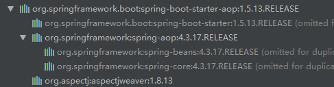
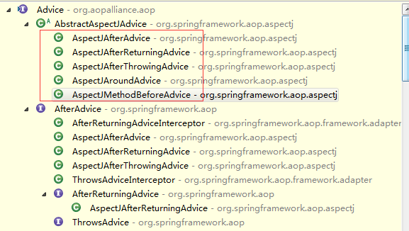

# SpringBoot集成AOP

### 1、添加pom依赖

```xml
<dependency>
    <groupId>org.springframework.boot</groupId>
    <artifactId>spring-boot-starter-aop</artifactId>
</dependency>
```



会看到它依赖于org.aspectj.aspectjweaver，而常用的aop注解都在这个包下**org.aspectj.lang.annotation**，像**@Before**、**@After**、**@AfterReturning**、**@AfterThrowing**、**@Around**、**@Pointcut**等。

通知方法：

- 前置通知(**@Before**)： 在目标方法运行之前执行。
- 后置通知(**@After**)： 在目标方法运行结束之后执行，不管正常结束还是异常结束，都会执行。
- 返回通知(**@AfterReturn**)： 在目标方法正常放回之后执行。
- 异常通知(**@AfterThrowing**)： 在目标方法出现异常以后执行。
- 环绕通知(**@Around**)： 动态代理，手动推进目标方法的执行。


### 2、Aop例子

```java
@Aspect
public class LogAspects {

	// 抽取公共的切入点表达式
	@Pointcut("execution(* org.com.cay.spring.annotation.aop.*.*(..))")
	public void logging() {
	}

	@Before(value = "logging()")
	public void logStart(JoinPoint joinPoint) {
		System.out
				.println(joinPoint.getSignature().getName() + "运行，参数列表是: {" + Arrays.asList(joinPoint.getArgs()) + "}");
	}

	@After(value = "logging()")
	public void logEnd(JoinPoint joinPoint) {
		System.out.println(joinPoint.getSignature().getName() + "结束...");
	}

	@AfterReturning(value = "logging()", returning = "result")
	public void logReturn(JoinPoint joinPoint, Object result) {
		System.out.println(joinPoint.getSignature().getName() + "正常结束，结果是: {" + result + "}");
	}

	@AfterThrowing(value = "logging()", throwing = "e")
	public void logException(JoinPoint joinPoint, Exception e) {
		System.out.println(joinPoint.getSignature().getName() + "异常，异常信息: {" + e.getMessage() + "}");
	}
}
```


### 3、原理

一旦导入了**spring-boot-starter-aop**依赖后，SpringBoot就会启动AOP的自动配置类**AopAutoConfiguration**：

```java
@Configuration
@ConditionalOnClass({ EnableAspectJAutoProxy.class, Aspect.class, Advice.class })
@ConditionalOnProperty(prefix = "spring.aop", name = "auto", havingValue = "true", matchIfMissing = true)
public class AopAutoConfiguration {

	@Configuration
	@EnableAspectJAutoProxy(proxyTargetClass = false)
	@ConditionalOnProperty(prefix = "spring.aop", name = "proxy-target-class", havingValue = "false", matchIfMissing = true)
	public static class JdkDynamicAutoProxyConfiguration {

	}

	@Configuration
	@EnableAspectJAutoProxy(proxyTargetClass = true)
	@ConditionalOnProperty(prefix = "spring.aop", name = "proxy-target-class", havingValue = "true", matchIfMissing = false)
	public static class CglibAutoProxyConfiguration {

	}

}
```

不管使用jdk代理还是cglib代理，都有**@EnableAspectJAutoProxy**注解，所以重点还是要从**@EnableAspectJAutoProxy**注解开始说起，咱们先来看看它的签名：

```java
@Target(ElementType.TYPE)
@Retention(RetentionPolicy.RUNTIME)
@Documented
@Import(AspectJAutoProxyRegistrar.class)
public @interface EnableAspectJAutoProxy {
	//other code...
}
```

从其源码中看到该注解会导入一个**AspectJAutoProxyRegistrar**注册器，再点进去看看：

```java
class AspectJAutoProxyRegistrar implements ImportBeanDefinitionRegistrar {

	@Override
	public void registerBeanDefinitions(
			AnnotationMetadata importingClassMetadata, BeanDefinitionRegistry registry) {
		AopConfigUtils.registerAspectJAnnotationAutoProxyCreatorIfNecessary(registry);

		//other code...
	}
}
```

重点在于**registerAspectJAnnotationAutoProxyCreatorIfNecessary**方法，进入方法深处，会看到：

```java
public static final String AUTO_PROXY_CREATOR_BEAN_NAME =
			"org.springframework.aop.config.internalAutoProxyCreator";

public static BeanDefinition registerAspectJAnnotationAutoProxyCreatorIfNecessary(BeanDefinitionRegistry registry) {
    return registerAspectJAnnotationAutoProxyCreatorIfNecessary(registry, null);
}

public static BeanDefinition registerAspectJAnnotationAutoProxyCreatorIfNecessary(BeanDefinitionRegistry registry, Object source) {
		return registerOrEscalateApcAsRequired(AnnotationAwareAspectJAutoProxyCreator.class, registry, source);
	}

private static BeanDefinition registerOrEscalateApcAsRequired(Class<?> cls, BeanDefinitionRegistry registry, Object source) {
    Assert.notNull(registry, "BeanDefinitionRegistry must not be null");
    if (registry.containsBeanDefinition(AUTO_PROXY_CREATOR_BEAN_NAME)) {
        BeanDefinition apcDefinition = registry.getBeanDefinition(AUTO_PROXY_CREATOR_BEAN_NAME);
        if (!cls.getName().equals(apcDefinition.getBeanClassName())) {
            int currentPriority = findPriorityForClass(apcDefinition.getBeanClassName());
            int requiredPriority = findPriorityForClass(cls);
            if (currentPriority < requiredPriority) {
                apcDefinition.setBeanClassName(cls.getName());
            }
        }
        return null;
    }
    RootBeanDefinition beanDefinition = new RootBeanDefinition(cls);
    beanDefinition.setSource(source);
    beanDefinition.getPropertyValues().add("order", Ordered.HIGHEST_PRECEDENCE);
    beanDefinition.setRole(BeanDefinition.ROLE_INFRASTRUCTURE);
    registry.registerBeanDefinition(AUTO_PROXY_CREATOR_BEAN_NAME, beanDefinition);
    return beanDefinition;
}
```

看到该方法会注册一个Bean，其名为**internalAutoProxyCreator**，而其值为**AnnotationAwareAspectJAutoProxyCreator**。


其继承树为：

**AnnotationAwareAspectJAutoProxyCreator**

> 继承**AspectJAwareAdvisorAutoProxyCreator**
>
> > 继承**AbstractAdvisorAutoProxyCreator**

> > > 继承**AbstractAutoProxyCreator**

> > > >  实现**SmartInstantiationAwareBeanPostProcessor**

> > > > > 继承**InstantiationAwareBeanPostProcessor** 
> > > > >
> > > > > Object postProcessBeforeInstantiation(Class<?> beanClass, String beanName) throws BeansException;
> > > > >
> > > > > boolean postProcessAfterInstantiation(Object bean, String beanName) throws BeansException;

> > > > > > 继承**BeanPostProcessor**
> > > > > >
> > > > > > Object postProcessBeforeInitialization(Object bean, String beanName) throws BeansException;
> > > > > >
> > > > > > Object postProcessAfterInitialization(Object bean, String beanName) throws BeansException;

重点就在于这四个函数，区别在于：

* ==**BeanPostProcessor**接口的两个方法是在Bean对象创建完成初始化前后调用的；==
* ==**InstantiationAwareBeanPostProcessor**接口的两个方法则是在创建Bean实例前后调用。==

==所以执行的逻辑顺序则是**postProcessBeforeInstantiation** -> **postProcessAfterInstantiation** -> **postProcessBeforeInitialization** -> **postProcessAfterInitialization**。==

其中**postProcessAfterInstantiation**和**postProcessBeforeInitialization**仅仅返回一个值，咱们就直接跳过，看其他两个方法的执行逻辑。


既然是研究AOP原理，那么咱们来看看MathCalculator和切面类LogAspects的创建过程，首先看**postProcessBeforeInstantiation**：

```java
public Object postProcessBeforeInstantiation(Class<?> beanClass, String beanName) throws BeansException {
    Object cacheKey = getCacheKey(beanClass, beanName);

    if (beanName == null || !this.targetSourcedBeans.contains(beanName)) {
        if (this.advisedBeans.containsKey(cacheKey)) {
            return null;
        }
        //判断创建的bean是否是基础类或者切面
        if (isInfrastructureClass(beanClass) || shouldSkip(beanClass, beanName)) {
            this.advisedBeans.put(cacheKey, Boolean.FALSE);
            return null;
        }
    }

    // Create proxy here if we have a custom TargetSource.
    // Suppresses unnecessary default instantiation of the target bean:
    // The TargetSource will handle target instances in a custom fashion.
    if (beanName != null) {
        //一般没有自定义TargetSource，所以直接返回null
        TargetSource targetSource = getCustomTargetSource(beanClass, beanName);
        if (targetSource != null) {
            this.targetSourcedBeans.add(beanName);
            Object[] specificInterceptors = getAdvicesAndAdvisorsForBean(beanClass, beanName, targetSource);
            Object proxy = createProxy(beanClass, beanName, specificInterceptors, targetSource);
            this.proxyTypes.put(cacheKey, proxy.getClass());
            return proxy;
        }
    }

    return null;
}
```

**AnnotationAwareAspectJAutoProxyCreator#isInfrastructureClass**方法

```java
protected boolean isInfrastructureClass(Class<?> beanClass) {
	//调用父类同名方法，或者判断当前Bean是否是Aspect切面
    return (super.isInfrastructureClass(beanClass) || this.aspectJAdvisorFactory.isAspect(beanClass));
}
```

调用父类的同名方法**AbstractAutoProxyCreator#isInfrastructureClass**

```java
protected boolean isInfrastructureClass(Class<?> beanClass) {
    boolean retVal = Advice.class.isAssignableFrom(beanClass) ||
        Pointcut.class.isAssignableFrom(beanClass) ||
            Advisor.class.isAssignableFrom(beanClass) ||
                AopInfrastructureBean.class.isAssignableFrom(beanClass);
    if (retVal && logger.isTraceEnabled()) {
        logger.trace("Did not attempt to auto-proxy infrastructure class [" + beanClass.getName() + "]");
    }
    return retVal;
}
```

从源码中看到**isInfrastructureClass**方法用于判断当前创建的bean是否是基础类型的**Advice**、**Pointcut**、**Advisor**、**AopInfrastructureBean**，或者是否是切面（**@Aspect**），如果满足条件，则将当前bean加入缓存中，并返回null；否则会查找当前IOC环境中，对当前创建的Bean有切入点的通知器Advisor（即增强器）。


接着看**postProcessAfterInitialization**：

```java
public Object postProcessAfterInitialization(Object bean, String beanName) throws BeansException {
    if (bean != null) {
        Object cacheKey = getCacheKey(bean.getClass(), beanName);
        if (!this.earlyProxyReferences.contains(cacheKey)) {
            return wrapIfNecessary(bean, beanName, cacheKey);
        }
    }
    return bean;
}
```

重点来了：

```java
protected Object wrapIfNecessary(Object bean, String beanName, Object cacheKey) {
    if (beanName != null && this.targetSourcedBeans.contains(beanName)) {
        return bean;
    }
    if (Boolean.FALSE.equals(this.advisedBeans.get(cacheKey))) {
        return bean;
    }
    if (isInfrastructureClass(bean.getClass()) || shouldSkip(bean.getClass(), beanName)) {
        this.advisedBeans.put(cacheKey, Boolean.FALSE);
        return bean;
    }

    // Create proxy if we have advice.
    Object[] specificInterceptors = getAdvicesAndAdvisorsForBean(bean.getClass(), beanName, null);
    if (specificInterceptors != DO_NOT_PROXY) {
        this.advisedBeans.put(cacheKey, Boolean.TRUE);
        //创建代理对象
        Object proxy = createProxy(
            bean.getClass(), beanName, specificInterceptors, new SingletonTargetSource(bean));
        this.proxyTypes.put(cacheKey, proxy.getClass());
        return proxy;
    }

    this.advisedBeans.put(cacheKey, Boolean.FALSE);
    return bean;
}
```

该逻辑和**postProcessBeforeInstantiation**方法类似，在创建MathCalculator这个Bean的时候，判断其不是基础类型的**Advice**、**Pointcut**、**Advisor**、**AopInfrastructureBean**，也不是切面**Aspect**，则会查找IOC容器中可以切入该Bean的所有增强器（通知器Advisor），并保存到**Object[] specificInterceptors**中，而且将当前bean保存到advisedBeans中；接着给当前bean创建代理对象：

* JdkDynamicAopProxy(config)：jdk动态代理

 * 				ObjenesisCglibAopProxy(config)：cglib的动态代理

以后容器中获取到的该Bean其实是这个组件的代理对象，所以在执行目标方法的时候，也就是执行代理对象的intercept方法。

而在创建**LogAspects**之前**postProcessBeforeInstantiation**方法中由于是切面Aspect，所以在advisedBeans保存了该bean对应的value值（false），所以在**postProcessAfterInitialization**之方法中，在Boolean.FALSE.equals(this.advisedBeans.get(cacheKey)) 逻辑true时直接返回bean。


最后在执行目标方法时，调用代理对象**CglibAopProxy#DynamicAdvisedInterceptor#intercept**方法：

```java
public Object intercept(Object proxy, Method method, Object[] args, MethodProxy methodProxy) throws Throwable {
    Object oldProxy = null;
    boolean setProxyContext = false;
    Class<?> targetClass = null;
    Object target = null;
    try {
        if (this.advised.exposeProxy) {
            // Make invocation available if necessary.
            oldProxy = AopContext.setCurrentProxy(proxy);
            setProxyContext = true;
        }
        // May be null. Get as late as possible to minimize the time we
        // "own" the target, in case it comes from a pool...
        target = getTarget();
        if (target != null) {
            targetClass = target.getClass();
        }
        
        //获取将要执行的目标方法拦截器链
        List<Object> chain = this.advised.getInterceptorsAndDynamicInterceptionAdvice(method, targetClass);
        Object retVal;
        // Check whether we only have one InvokerInterceptor: that is,
        // no real advice, but just reflective invocation of the target.
        if (chain.isEmpty() && Modifier.isPublic(method.getModifiers())) {
            // We can skip creating a MethodInvocation: just invoke the target directly.
            // Note that the final invoker must be an InvokerInterceptor, so we know
            // it does nothing but a reflective operation on the target, and no hot
            // swapping or fancy proxying.
            Object[] argsToUse = AopProxyUtils.adaptArgumentsIfNecessary(method, args);
            retVal = methodProxy.invoke(target, argsToUse);
        }
        else {
            // We need to create a method invocation...
            retVal = new CglibMethodInvocation(proxy, target, method, args, targetClass, chain, methodProxy).proceed();
        }
        retVal = processReturnType(proxy, target, method, retVal);
        return retVal;
    }
    finally {
        if (target != null) {
            releaseTarget(target);
        }
        if (setProxyContext) {
            // Restore old proxy.
            AopContext.setCurrentProxy(oldProxy);
        }
    }
}
```

获取将要执行的目标方法的方法拦截链：

```java
public List<Object> getInterceptorsAndDynamicInterceptionAdvice(
			Advised config, Method method, Class<?> targetClass) {
	// This is somewhat tricky... We have to process introductions first,
	// but we need to preserve order in the ultimate list.
	List<Object> interceptorList = new ArrayList<Object>(config.getAdvisors().length);
	Class<?> actualClass = (targetClass != null ? targetClass : method.getDeclaringClass());
	boolean hasIntroductions = hasMatchingIntroductions(config, actualClass);
	AdvisorAdapterRegistry registry = GlobalAdvisorAdapterRegistry.getInstance();

    //遍历所有的增强器
	for (Advisor advisor : config.getAdvisors()) {
		if (advisor instanceof PointcutAdvisor) {
			// Add it conditionally.
			PointcutAdvisor pointcutAdvisor = (PointcutAdvisor) advisor;
			if (config.isPreFiltered() || pointcutAdvisor.getPointcut().getClassFilter().matches(actualClass)) {
                
                //获取增强器的方法拦截器
				MethodInterceptor[] interceptors = registry.getInterceptors(advisor);
				MethodMatcher mm = pointcutAdvisor.getPointcut().getMethodMatcher();
				if (MethodMatchers.matches(mm, method, actualClass, hasIntroductions)) {
					if (mm.isRuntime()) {
						// Creating a new object instance in the getInterceptors() method
						// isn't a problem as we normally cache created chains.
						for (MethodInterceptor interceptor : interceptors) {
							interceptorList.add(new InterceptorAndDynamicMethodMatcher(interceptor, mm));
						}
					}
					else {
						interceptorList.addAll(Arrays.asList(interceptors));
					}
				}
			}
		}
		else if (advisor instanceof IntroductionAdvisor) {
			IntroductionAdvisor ia = (IntroductionAdvisor) advisor;
			if (config.isPreFiltered() || ia.getClassFilter().matches(actualClass)) {
				Interceptor[] interceptors = registry.getInterceptors(advisor);
				interceptorList.addAll(Arrays.asList(interceptors));
			}
		}
		else {
			Interceptor[] interceptors = registry.getInterceptors(advisor);
			interceptorList.addAll(Arrays.asList(interceptors));
		}
	}

	return interceptorList;
}
```
根据增强器获取对应的方法拦截器：

```java
public MethodInterceptor[] getInterceptors(Advisor advisor) throws UnknownAdviceTypeException {
    List<MethodInterceptor> interceptors = new ArrayList<MethodInterceptor>(3);
    Advice advice = advisor.getAdvice();
    if (advice instanceof MethodInterceptor) {
        interceptors.add((MethodInterceptor) advice);
    }
    for (AdvisorAdapter adapter : this.adapters) {
        if (adapter.supportsAdvice(advice)) {
            interceptors.add(adapter.getInterceptor(advisor));
        }
    }
    if (interceptors.isEmpty()) {
        throw new UnknownAdviceTypeException(advisor.getAdvice());
    }
    return interceptors.toArray(new MethodInterceptor[interceptors.size()]);
}
```



红框标注的为Advice接口的5种实现通知类，分别对应5个通知注解：

```
AspectJMethodBeforeAdvice -> @Before
AspectJAfterAdvice -> @After
AspectJAfterReturningAdvice -> @AfterReturning
AspectJAfterThrowingAdvice -> @AfterThrowing
AspectJAroundAdvice -> @Around
```

其中**AspectJAfterThrowingAdvice**、**AspectJAfterAdvice**、**AspectJAroundAdvice**是**MethodInterceptor**子类，而**AfterReturningAdvice**和**AspectJMethodBeforeAdvice**不是**MethodInterceptor**子类。如果是**MethodInterceptor**子类，则直接加入到集合中，而如果不是**MethodInterceptor**子类，则通过**AdvisorAdapter**将增强器转换为**MethodInterceptor**，然后加入到集合中，最后返回给拦截器链。


可以看下从Advisor转换成MethodInterceptor的逻辑：

```java
class AfterReturningAdviceAdapter implements AdvisorAdapter, Serializable {

	@Override
	public boolean supportsAdvice(Advice advice) {
		return (advice instanceof AfterReturningAdvice);
	}

	@Override
	public MethodInterceptor getInterceptor(Advisor advisor) {
		AfterReturningAdvice advice = (AfterReturningAdvice) advisor.getAdvice();
		return new AfterReturningAdviceInterceptor(advice);
	}
}

class MethodBeforeAdviceAdapter implements AdvisorAdapter, Serializable {

	@Override
	public boolean supportsAdvice(Advice advice) {
		return (advice instanceof MethodBeforeAdvice);
	}

	@Override
	public MethodInterceptor getInterceptor(Advisor advisor) {
		MethodBeforeAdvice advice = (MethodBeforeAdvice) advisor.getAdvice();
		return new MethodBeforeAdviceInterceptor(advice);
	}
}
```


逻辑相对复杂，咱们来重新梳理一下过程：

* 首先CglibAopProxy.intercept()拦截目标方法的执行
* 根据**AdvisedSupport**对象获取将要执行的目标方法拦截器链

```java
List<Object> chain = this.advised.getInterceptorsAndDynamicInterceptionAdvice(method, targetClass);
```

* 在**getInterceptorsAndDynamicInterceptionAdvice**方法中，会遍历所有的增强器，并根据增强器获取对应的方法拦截器

```java
for (Advisor advisor : config.getAdvisors()) {
    //other code...
    MethodInterceptor[] interceptors = registry.getInterceptors(advisor);
    
    //other code...
}
```

* 在**getInterceptors**中判断当前增强器是否是**MethodInterceptor**子类，如果是则直接加入到集合中；如果不是，则通过**AdvisorAdapter**将增强器转为**MethodInterceptor**后加入集合中，最后返回该集合。


完成方法拦截器链之后，正式来到了逻辑的执行方法。

如果没有拦截器链，则直接执行目标方法：

```java
if (chain.isEmpty() && Modifier.isPublic(method.getModifiers())) {
    Object[] argsToUse = AopProxyUtils.adaptArgumentsIfNecessary(method, args);
    retVal = methodProxy.invoke(target, argsToUse);
}
```

否则:

```java
retVal = new CglibMethodInvocation(proxy, target, method, args, targetClass, chain, methodProxy).proceed();
```

重点是proceed()方法：

```java
public Object proceed() throws Throwable {
    //	We start with an index of -1 and increment early.
    if (this.currentInterceptorIndex == this.interceptorsAndDynamicMethodMatchers.size() - 1) {
        return invokeJoinpoint();
    }

    Object interceptorOrInterceptionAdvice =
        this.interceptorsAndDynamicMethodMatchers.get(++this.currentInterceptorIndex);
    if (interceptorOrInterceptionAdvice instanceof InterceptorAndDynamicMethodMatcher) {
        // Evaluate dynamic method matcher here: static part will already have
        // been evaluated and found to match.
        InterceptorAndDynamicMethodMatcher dm =
            (InterceptorAndDynamicMethodMatcher) interceptorOrInterceptionAdvice;
        if (dm.methodMatcher.matches(this.method, this.targetClass, this.arguments)) {
            return dm.interceptor.invoke(this);
        }
        else {
            // Dynamic matching failed.
            // Skip this interceptor and invoke the next in the chain.
            return proceed();
        }
    }
    else {
        // It's an interceptor, so we just invoke it: The pointcut will have
        // been evaluated statically before this object was constructed.
        return ((MethodInterceptor) interceptorOrInterceptionAdvice).invoke(this);
    }
}
```

这些Advice

对应的**MethodInterceptor**都不是**InterceptorAndDynamicMethodMatcher**子类，所以直接执行下面的语句：

```java
return ((MethodInterceptor) interceptorOrInterceptionAdvice).invoke(this);
```

进入invoke函数

* **MethodBeforeAdviceInterceptor**对应前置通知器的invoke方法

```java
public Object invoke(MethodInvocation mi) throws Throwable {
    this.advice.before(mi.getMethod(), mi.getArguments(), mi.getThis() );
    return mi.proceed();
}
```

* **AspectJAfterAdvice**对应后置通知器的invoke方法

```java
public Object invoke(MethodInvocation mi) throws Throwable {
    try {
        return mi.proceed();
    }
    finally {
        invokeAdviceMethod(getJoinPointMatch(), null, null);
    }
}
```

* **AspectJAfterThrowingAdvice**对应异常通知器的invoke方法

```java
public Object invoke(MethodInvocation mi) throws Throwable {
    try {
        return mi.proceed();
    }
    catch (Throwable ex) {
        if (shouldInvokeOnThrowing(ex)) {
            invokeAdviceMethod(getJoinPointMatch(), null, ex);
        }
        throw ex;
    }
}
```

* **AfterReturningAdviceInterceptor**对应返回通知器的invoke方法

```java
public Object invoke(MethodInvocation mi) throws Throwable {
    Object retVal = mi.proceed();
    this.advice.afterReturning(retVal, mi.getMethod(), mi.getArguments(), mi.getThis());
    return retVal;
}
```

* **AspectJAroundAdvice**对应环绕通知器的invoke方法

```java
public Object invoke(MethodInvocation mi) throws Throwable {
    if (!(mi instanceof ProxyMethodInvocation)) {
        throw new IllegalStateException("MethodInvocation is not a Spring ProxyMethodInvocation: " + mi);
    }
    ProxyMethodInvocation pmi = (ProxyMethodInvocation) mi;
    ProceedingJoinPoint pjp = lazyGetProceedingJoinPoint(pmi);
    JoinPointMatch jpm = getJoinPointMatch(pmi);
    return invokeAdviceMethod(pjp, jpm, null, null);
}
```

依次使用**==递归==**的方式调用通知方法。

* 在proceed()方法中看到，当拦截器的索引和拦截器数组大小减去1之后大小一样（指定到了最后一个拦截器）就会执行目标方法；
* 链式获取每一个拦截器，拦截器执行invoke方法，每一个拦截器等待下一个拦截器执行proceed完成并返回以后再来执行当前拦截器，直到所有拦截器都正常返回后，则结束。


|                           **QQ:**                            |                        **412425870**                         |
| :----------------------------------------------------------: | :----------------------------------------------------------: |
|                   **微信公众号：Cay课堂**                    |                                |
|                        **csdn博客：**                        | [http://blog.csdn.net/caychen](http://blog.csdn.net/caychen) |
|                          **码云：**                          |   [https://gitee.com/caychen/](https://gitee.com/caychen/)   |
|                         **github：**                         |   [https://github.com/caychen](https://github.com/caychen)   |
| **点击群号或者扫描二维码即可加入QQ群:[328243383(1群)](https://jq.qq.com/?_wv=1027&k=5wfhR5N)** |                                         |
| **点击群号或者扫描二维码即可加入QQ群:[180479701(2群)](https://jq.qq.com/?_wv=1027&k=5DFkoIm)** |                                         |

