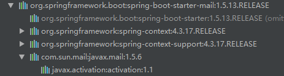

## 使用SpringBoot发送mail邮件

### 1、前言

发送邮件应该是网站的必备拓展功能之一，注册验证，忘记密码或者是给用户发送营销信息。正常我们会用JavaMail相关api来写发送邮件的相关代码，但现在springboot提供了一套更简易使用的封装。


### 2、Mail依赖

```xml
<dependency>
    <groupId>org.springframework.boot</groupId>
    <artifactId>spring-boot-starter-mail</artifactId>
    <version>${spring-boot-mail.version}</version>
</dependency>
```

来看看其依赖树：



可以看到spring-boot-starter-mail-xxx.jar对Sun公司的邮件api功能进行了相应的封装。


### 3、Mail自动配置类: MailSenderAutoConfiguration

其实肯定可以猜到Spring Boot对Mail功能已经配置了相关的基本配置信息，它是Spring Boot官方提供，其类为**MailSenderAutoConfiguration**：

```java
//MailSenderAutoConfiguration
@Configuration
@ConditionalOnClass({ MimeMessage.class, MimeType.class })
@ConditionalOnMissingBean(MailSender.class)
@Conditional(MailSenderCondition.class)
@EnableConfigurationProperties(MailProperties.class)
@Import(JndiSessionConfiguration.class)
public class MailSenderAutoConfiguration {

    private final MailProperties properties;

	private final Session session;

	public MailSenderAutoConfiguration(MailProperties properties,
			ObjectProvider<Session> session) {
		this.properties = properties;
		this.session = session.getIfAvailable();
	}

	@Bean
	public JavaMailSenderImpl mailSender() {
		JavaMailSenderImpl sender = new JavaMailSenderImpl();
		if (this.session != null) {
			sender.setSession(this.session);
		}
		else {
			applyProperties(sender);
		}
		return sender;
	}
    
    //other code...
}
```

首先，它会通过注入Mail的属性配置类**MailProperties**：

```java
@ConfigurationProperties(prefix = "spring.mail")
public class MailProperties {

	private static final Charset DEFAULT_CHARSET = Charset.forName("UTF-8");

	/**
	 * SMTP server host.
	 */
	private String host;

	/**
	 * SMTP server port.
	 */
	private Integer port;

	/**
	 * Login user of the SMTP server.
	 */
	private String username;

	/**
	 * Login password of the SMTP server.
	 */
	private String password;

	/**
	 * Protocol used by the SMTP server.
	 */
	private String protocol = "smtp";

	/**
	 * Default MimeMessage encoding.
	 */
	private Charset defaultEncoding = DEFAULT_CHARSET;

	/**
	 * Additional JavaMail session properties.
	 */
	private Map<String, String> properties = new HashMap<String, String>();

	/**
	 * Session JNDI name. When set, takes precedence to others mail settings.
	 */
	private String jndiName;

	/**
	 * Test that the mail server is available on startup.
	 */
	private boolean testConnection;
    
    //other code...
    
}
```

在**MailSenderAutoConfiguration**自动配置类中，创建了一个Bean，其类为**JavaMailSenderImpl**，它是Spring专门用来发送Mail邮件的服务类，SpringBoot也使用它来发送邮件。它是**JavaMailSender**接口的实现类，通过它的send()方法来发送不同类型的邮件，主要分为两类，一类是简单的文本邮件，不带任何html格式，不带附件，不带图片等简单邮件，还有一类则是带有html格式文本或者链接，有附件或者图片的复杂邮件。


### 4、发送邮件

通用配置**application.properties**:

```properties
# 设置邮箱主机
spring.mail.host=smtp.qq.com

# 设置用户名
spring.mail.username=xxxxxx@qq.com

# 设置密码，该处的密码是QQ邮箱开启SMTP的授权码而非QQ密码
spring.mail.password=pwvtabrwxogxidac

# 设置是否需要认证，如果为true,那么用户名和密码就必须的，
# 如果设置false，可以不设置用户名和密码，当然也得看你的对接的平台是否支持无密码进行访问的。
spring.mail.properties.mail.smtp.auth=true

# STARTTLS[1]  是对纯文本通信协议的扩展。它提供一种方式将纯文本连接升级为加密连接（TLS或SSL），而不是另外使用一个端口作加密通信。
spring.mail.properties.mail.smtp.starttls.enable=true
spring.mail.properties.mail.smtp.starttls.required=true

mail.from=${spring.mail.username}
mail.to=yyyyyy@qq.com
```

由于使用QQ邮箱的用户占多数，所以这里选择QQ邮箱作为测试。还有注意的是**spring.mail.password**这个值不是QQ邮箱的密码，而是QQ邮箱给第三方客户端邮箱生成的**授权码**。具体要登录QQ邮箱，点击设置，找到SMTP服务：


默认SMTP服务是关闭的，即默认状态为关闭状态，如果是第一次操作，点击开启后，会通过验证会获取到授权码；而我之前已经开启过SMTP服务，所以直接点击生成授权码后通过验证获取到授权码。


自定义的**MailProperties**配置类，用于解析mail开头的配置属性：

```java
@Component
@ConfigurationProperties(prefix = "mail")
public class MailProperties {

    private String from;

    private String to;

   //getter and setter...
}
```


#### 4.1、测试发送简单文本邮件

```java
@SpringBootTest
@RunWith(SpringJUnit4ClassRunner.class)
public class SimpleMailTest {

	@Autowired
	private MailService mailService;

	@Test
	public void sendMail(){

		mailService.sendSimpleMail("测试Springboot发送邮件", "发送邮件...");
	}
}
```

**sendSimpleMail()**：

```java
@Override
public void sendSimpleMail(String subject, String text) {
    SimpleMailMessage mailMessage = new SimpleMailMessage();
    mailMessage.setFrom(mailProperties.getFrom());
    mailMessage.setTo(mailProperties.getTo());

    mailMessage.setSubject(subject);
    mailMessage.setText(text);

    javaMailSender.send(mailMessage);
}
```

观察结果：


#### 4.2、测试发送带有链接和附件的复杂邮件

事先准备一个文件file.txt，放在resources/public/目录下。

```java
@SpringBootTest
@RunWith(SpringJUnit4ClassRunner.class)
public class MimeMailTest {

	@Autowired
	private MailService mailService;

	@Test
	public void testMail() throws MessagingException {

		Map<String, String> attachmentMap = new HashMap<>();
		attachmentMap.put("附件", "file.txt的绝对路径");

		mailService.sendHtmlMail("测试Springboot发送带附件的邮件", "欢迎进入<a href=\"http://www.baidu.com\">百度首页</a>", attachmentMap);

	}
}
```

**sendHtmlMail()**:

```java
@Override
public void sendHtmlMail(String subject, String text, Map<String, String> attachmentMap) throws MessagingException {
    MimeMessage mimeMessage = javaMailSender.createMimeMessage();

    //是否发送的邮件是富文本（附件，图片，html等）
    MimeMessageHelper messageHelper = new MimeMessageHelper(mimeMessage, true);

    messageHelper.setFrom(mailProperties.getFrom());
    messageHelper.setTo(mailProperties.getTo());

    messageHelper.setSubject(subject);
    messageHelper.setText(text, true);//重点，默认为false，显示原始html代码，无效果

    if(attachmentMap != null){
        attachmentMap.entrySet().stream().forEach(entrySet -> {
            try {
                File file = new File(entrySet.getValue());
                if(file.exists()){
                    messageHelper.addAttachment(entrySet.getKey(), new FileSystemResource(file));
                }
            } catch (MessagingException e) {
                e.printStackTrace();
            }
        });
    }

    javaMailSender.send(mimeMessage);
}
```

观察结果：


#### 4.3、测试发送模版邮件

这里使用Freemarker作为模版引擎。

```xml
<dependency>
    <groupId>org.springframework.boot</groupId>
    <artifactId>spring-boot-starter-freemarker</artifactId>
    <version>${spring-boot-freemarker.version}</version>
</dependency>
```

事先准备一个模版文件mail.ftl

```html
<html>
<body>
	<h3>你好， <span style="color: red;">${username}</span>, 这是一封模板邮件!</h3>
</body>
</html>
```

模版测试类：

```java
@SpringBootTest
@RunWith(SpringJUnit4ClassRunner.class)
public class MailTemplateTest {

	@Autowired
	private MailService mailService;

	@Test
	public void testFreemarkerMail() throws MessagingException, IOException, TemplateException {

		Map<String, Object> params = new HashMap<>();
		params.put("username", "Cay");

		mailService.sendTemplateMail("测试Springboot发送模版邮件", params);

	}
}
```

**sendTemplateMail()**:

```java
@Override
public void sendTemplateMail(String subject, Map<String, Object> params) throws MessagingException, IOException, TemplateException {
    MimeMessage mimeMessage = javaMailSender.createMimeMessage();

    MimeMessageHelper helper = new MimeMessageHelper(mimeMessage, true);

    helper.setFrom(mailProperties.getFrom());
    helper.setTo(mailProperties.getTo());

    Configuration configuration = new Configuration(Configuration.VERSION_2_3_28);
    configuration.setClassForTemplateLoading(this.getClass(), "/templates");

    String html = FreeMarkerTemplateUtils.processTemplateIntoString(configuration.getTemplate("mail.ftl"), params);

    helper.setSubject(subject);
    helper.setText(html, true);//重点，默认为false，显示原始html代码，无效果

    javaMailSender.send(mimeMessage);
}
```

观察结果：

