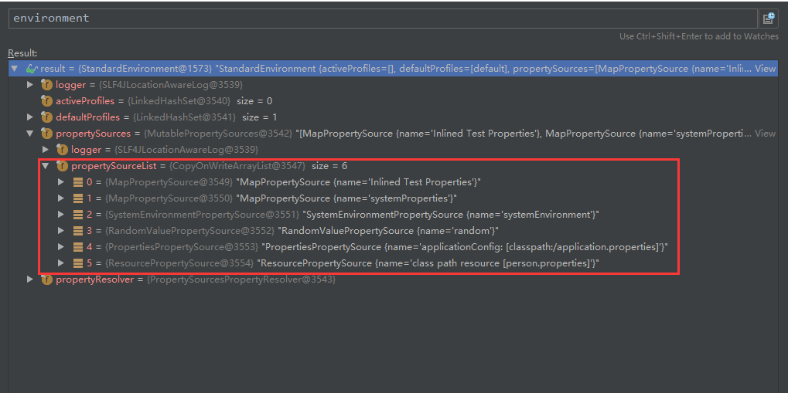
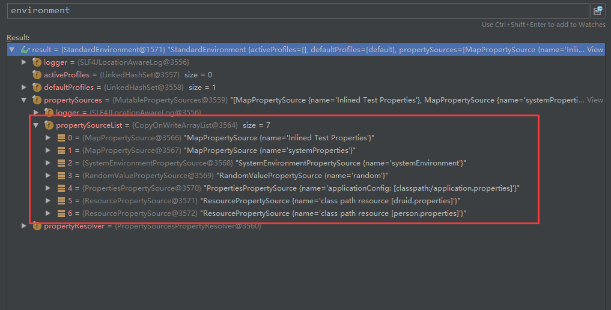

## 一、 前言

​	在Spring Boot中常常会用到配置文件，最常见的莫过于**数据源**，基本上都使用配置文件的方式进行配置了，即在application.properties/yml中配置连接数据库的基本信息。

```xml
#driver配置不需要配置，Spring Boot会从配置的url中试图获取driver名
spring.datasourc.driver=com.mysql.jdbc.Driver
spring.datasource.url=jdbc:mysql:///springboot
spring.datasource.username=root
spring.datasource.password=admin
```

具体在**DataSourceBuilder**类的build()方法中。

#### **==DataSourceBuilder.build()==**

```java
public DataSource build() {
    Class<? extends DataSource> type = getType();
    DataSource result = BeanUtils.instantiate(type);
    //试图尝试获取driver名
    maybeGetDriverClassName();
    bind(result);
    return result;
}
```

#### **==DataSourceBuilder.maybeGetDriverClassName()：==**

```java
private void maybeGetDriverClassName() {
    if (!this.properties.containsKey("driverClassName")
        && this.properties.containsKey("url")) {
        String url = this.properties.get("url");
        //从url中获取driver
        String driverClass = DatabaseDriver.fromJdbcUrl(url).getDriverClassName();
        this.properties.put("driverClassName", driverClass);
    }
}
```

#### **==DatabaseDriver.fromJdbcUrl():==**

**DatabaseDriver**是个**Enum**枚举类，列举了所有数据库的驱动。

```java
public static DatabaseDriver fromJdbcUrl(String url) {
    if (StringUtils.hasLength(url)) {
        Assert.isTrue(url.startsWith("jdbc"), "URL must start with 'jdbc'");
        String urlWithoutPrefix = url.substring("jdbc".length()).toLowerCase();
        //values()返回Spring Boot配置的所有数据库驱动
        for (DatabaseDriver driver : values()) {
            for (String urlPrefix : driver.getUrlPrefixes()) {
                String prefix = ":" + urlPrefix + ":";
                if (driver != UNKNOWN && urlWithoutPrefix.startsWith(prefix)) {
                    return driver;
                }
            }
        }
    }
    return UNKNOWN;
}
```

#### ==**DatabaseDriver:**==

```java
public enum DatabaseDriver {

	UNKNOWN(null, null),

	DERBY("Apache Derby", "org.apache.derby.jdbc.EmbeddedDriver",
			"org.apache.derby.jdbc.EmbeddedXADataSource",
			"SELECT 1 FROM SYSIBM.SYSDUMMY1"),

	H2("H2", "org.h2.Driver", "org.h2.jdbcx.JdbcDataSource", "SELECT 1"),

	HSQLDB("HSQL Database Engine", "org.hsqldb.jdbc.JDBCDriver",
			"org.hsqldb.jdbc.pool.JDBCXADataSource",
			"SELECT COUNT(*) FROM INFORMATION_SCHEMA.SYSTEM_USERS"),
    
	SQLITE("SQLite", "org.sqlite.JDBC"),

	MYSQL("MySQL", "com.mysql.jdbc.Driver",
			"com.mysql.jdbc.jdbc2.optional.MysqlXADataSource", "SELECT 1"),

	MARIADB("MySQL", "org.mariadb.jdbc.Driver", "org.mariadb.jdbc.MariaDbDataSource",
			"SELECT 1") {

		//other code...
	},

	GAE(null, "com.google.appengine.api.rdbms.AppEngineDriver"),


	ORACLE("Oracle", "oracle.jdbc.OracleDriver",
			"oracle.jdbc.xa.client.OracleXADataSource", "SELECT 'Hello' from DUAL"),

	POSTGRESQL("PostgreSQL", "org.postgresql.Driver", "org.postgresql.xa.PGXADataSource",
			"SELECT 1"),

	JTDS(null, "net.sourceforge.jtds.jdbc.Driver"),

	SQLSERVER("Microsoft SQL Server", "com.microsoft.sqlserver.jdbc.SQLServerDriver",
			"com.microsoft.sqlserver.jdbc.SQLServerXADataSource", "SELECT 1") {

		//other code...
	},

	FIREBIRD("Firebird", "org.firebirdsql.jdbc.FBDriver",
			"org.firebirdsql.ds.FBXADataSource",
			"SELECT 1 FROM RDB$DATABASE") {

		//other code...
	},

	DB2("DB2", "com.ibm.db2.jcc.DB2Driver", "com.ibm.db2.jcc.DB2XADataSource",
			"SELECT 1 FROM SYSIBM.SYSDUMMY1") {

		//other code...
	},

	DB2_AS400("DB2 UDB for AS/400", "com.ibm.as400.access.AS400JDBCDriver",
			"com.ibm.as400.access.AS400JDBCXADataSource",
			"SELECT 1 FROM SYSIBM.SYSDUMMY1") {

		//other code...
	},

	TERADATA("Teradata", "com.teradata.jdbc.TeraDriver"),

	INFORMIX("Informix Dynamic Server", "com.informix.jdbc.IfxDriver", null,
			"select count(*) from systables") {
	
		//other code...
	};
    
    //other code...
}
```


## 二、属性注入与Bean创建

​	在[【Spring Boot】（4）、配置文件值注入](https://mp.weixin.qq.com/s?__biz=MzU5NjUxNDg1NQ==&mid=2247483696&idx=1&sn=9dee17cff01f3353893c6db1e1711441&chksm=fe60c078c917496e6e53db61946120c60025fd7ce3c6977dd956f16f84d954825b713e3e5d8e#rd)文中简单地讲述了配置文件中属性值的注入，本文重新讲述几种属性注入的方法：

* @Value注解
* Environment环境变量
* @ConfigurationProperties和@PropertySource注解
  * 注入全局配置
  * 注入非全局（即外部）配置

在讲述各种属性注入方式的同时，顺便使用该注入方式进行Bean的创建，本文以创建**DataSource**数据源为例。


### 2.1、@Value注解

​	在[【Spring Boot】（4）、配置文件值注入](https://mp.weixin.qq.com/s?__biz=MzU5NjUxNDg1NQ==&mid=2247483696&idx=1&sn=9dee17cff01f3353893c6db1e1711441&chksm=fe60c078c917496e6e53db61946120c60025fd7ce3c6977dd956f16f84d954825b713e3e5d8e#rd)文中也讲了使用**@Value**注解的优缺点。

```properties
#dbcp2.properties
dbcp2.driver=com.mysql.jdbc.Driver
dbcp2.url=jdbc:mysql:///springboot
dbcp2.username=root
dbcp2.password=admin
```

```java
@Configuration
@PropertySource("classpath:dbcp2.properties")//如果配置信息不在全局配置文件application.properties/yml中，则需要显式加载外部properties
public class Dbcp2Config {

	@Value("${dbcp2.driver}")
	private String driver;

	@Value("${dbcp2.url}")
	private String url;

	@Value("${dbcp2.username}")
	private String username;

	@Value("${dbcp2.password}")
	private String password;
    
    //...
}
```

注意点：如果dbcp2的配置放置在外部配置文件中，必须显式地加载外部配置文件；否则的话，使用**@Value**就会提示`java.lang.IllegalArgumentException: Could not resolve placeholder 'dbcp2.driver' in value "${dbcp2.driver}"`的异常信息。


最后创建dbcp2的DataSource的时候，可以直接使用最基本的四个参数值就可以完成Bean的创建。

```java
@Configuration
@PropertySource("classpath:dbcp2.properties")//如果配置信息不在全局配置文件application.properties/yml中，则需要显式加载外部properties
public class Dbcp2Config {

	@Value("${dbcp2.driver}")
	private String driver;

	@Value("${dbcp2.url}")
	private String url;

	@Value("${dbcp2.username}")
	private String username;

	@Value("${dbcp2.password}")
	private String password;
    
    @Bean("dbcp2")
    public DataSource dataSource(){
        BasicDataSource dataSource = new BasicDataSource();
        System.out.println("@Value ===================：" + driver);

        dataSource.setDriverClassName(driver);
        dataSource.setUrl(url);
        dataSource.setUsername(username);
        dataSource.setPassword(password);

        return dataSource;
    }
}
```


### 2.2、Environment环境变量

​	其实使用**Environment**变量和使用**@Value**注解类似，不同的是：**@Value**是直接将值注入到具体的属性上，而**Environment**是把所有的配置项添加到环境变量中，然后在取值的时候使用**getProperty(key)**方法即可。

```properties
#c3p0.properties
c3p0.driver=com.mysql.jdbc.Driver
c3p0.url=jdbc:mysql:///springboot
c3p0.username=root
c3p0.password=admin
```

```java
@Configuration
@PropertySource("classpath:c3p0.properties")//引入外部配置文件
public class C3p0Config {

	@Autowired
	private Environment env;

}
```

注意点：使用**Environment**环境变量和使用**@Value**注解一样，对于外部配置文件需要显式加载。

```java
@Configuration
@PropertySource("classpath:c3p0.properties")//引入外部配置文件
public class C3p0Config {

	@Autowired
	private Environment env;
	
    @Bean("c3p0")
    public DataSource dataSource() throws PropertyVetoException {
        ComboPooledDataSource dataSource = new ComboPooledDataSource();
        System.out.println("env ==========：" + env.getProperty("c3p0.driver"));

        dataSource.setDriverClass(env.getProperty("c3p0.driver"));
        dataSource.setJdbcUrl(env.getProperty("c3p0.url"));
        dataSource.setUser(env.getProperty("c3p0.username"));
        dataSource.setPassword(env.getProperty("c3p0.password"));
        return dataSource;
    }
}
```

**Environment**的**getProperty()**有个重载的方法：

```java
String getProperty(String key);
String getProperty(String key, String defaultValue);
```

如果使用**getProperty(key)**，如果key不存在的时候，方法返回null，而不会报异常，这跟@Value有些区别。如果使用**getProperty(key, defaultValue)**，见名思意，即当key不存在的时候，可以使用指定的默认值代替。


### 2.3、@ConfigurationProperties和@PropertySource注解

#### 2.3.1、注入全局配置属性

```properties
#application.properties
druid.driver-class-name=com.mysql.jdbc.Driver
druid.url=jdbc:mysql:///springboot
druid.username=root
druid.password=admin
```

```java
@ConfigurationProperties(prefix = "druid")
public class DruidProperties {

	private String driverClassName;
	private String url;
	private String username;
	private String password;

	//getter和setter
}
```

```java
@Configuration
@EnableConfigurationProperties(DruidProperties.class)
public class DruidConfig {

	private DruidProperties properties;

	public DruidConfig(DruidProperties properties){
		this.properties = properties;
	}
}
```

​	**@EnableConfigurationProperties**启动配置功能，将对应的**DruidProperties**配置类与全局配置文件（默认）中的以druid为前缀的配置项进行绑定并注入，并将**DruidProperties**配置类注入到Spring的IOC环境中。这个时候就可以创建一个**DruidDataSource**的Bean。

```java
@Configuration
@EnableConfigurationProperties(DruidProperties.class)
public class DruidConfig {

	private DruidProperties properties;

	public DruidConfig(DruidProperties properties){
		this.properties = properties;
	}
    
    @Bean("druid")
    public DruidDataSource dataSource(){
        System.out.println("properties =====================：" + properties.getDriverClassName());

        DruidDataSource dataSource = new DruidDataSource();
        dataSource.setDriverClassName(properties.getDriverClassName());
        dataSource.setUrl(properties.getUrl());
        dataSource.setUsername(properties.getUsername());
        dataSource.setPassword(properties.getPassword());
        return dataSource;
    }
}
```

此时创建的DataSource中包含了基本的四个属性值，就能执行数据库操作了。


#### 2.3.2、注入外部配置属性

还是同全局配置中的属性值一样，只是将其提取到druid.properties中了。

```properties
#druid.properties
druid.driver-class-name=com.mysql.jdbc.Driver
druid.url=jdbc:mysql:///springboot
druid.username=root
druid.password=admin
```

在DruidProperties中加入`@PropertySource("classpath:druid.properties")`一行，提示Spring Boot从外部druid.properties中读取属性值。

```java
@ConfigurationProperties(prefix = "druid")
@PropertySource("classpath:druid.properties")
public class DruidProperties {

	private String driverClassName;
	private String url;
	private String username;
	private String password;

	//getter和setter
}
```

DruidConfig.java同上小节的一样，保持不变。

​	在运行的时候，会发现**DruidProperties**并未注入，即数据源的四个属性值都未正常注入。在调试的时候，发现**DruidProperties**的属性setter方法并未进入。

​	其实注入外部配置属性的时候，需要手动将该类注册为组件，即使用**@Component**或者**@Configuration**注解才行。与此同时，由于**DruidConfig**类上有个`@EnableConfigurationProperties(DruidProperties.class)`注解，既然已经手动在**DruidProperties**上添加了**@Component**或者**@Configuration**注解使其成为组件，那么就无需再在**DruidConfig**上通过`@EnableConfigurationProperties(DruidProperties.class)`再将**DruidProperties**注册为组件，否则会在自动注入使用**DruidProperties**的时候会找到两个Bean，导致出现`org.springframework.beans.factory.NoUniqueBeanDefinitionException`唯一性异常。

代码如下：

```java
@Component
@ConfigurationProperties(prefix = "druid")
@PropertySource("classpath:druid.properties")
public class DruidProperties {

	private String driverClassName;
	private String url;
	private String username;
	private String password;

	//other code...
}

```

```java
@Configuration
@EnableConfigurationProperties//(DruidProperties.class)
public class DruidConfig {

	private DruidProperties properties;

	public DruidConfig(DruidProperties properties){
		this.properties = properties;
	}

	@Bean("druid")
	public DruidDataSource dataSource(){
		System.out.println("properties =====================：" + properties.getDriverClassName());

		DruidDataSource dataSource = new DruidDataSource();
		dataSource.setDriverClassName(properties.getDriverClassName());
		dataSource.setUrl(properties.getUrl());
		dataSource.setUsername(properties.getUsername());
		dataSource.setPassword(properties.getPassword());
		return dataSource;
	}
}
```


​	

## 三、疑问？

​	在第2.3.1小节中讲述到，使用**@EnableConfigurationProperties**会将其属性value对应的配置类与配置文件绑定，并将其注入到Spring IOC容器中。而对于第2.3.2小节中，既然有这个功能，为什么还要在配置类上加上组件注解吗？

​	**==其实博主在调试的时候，发现Spring IOC容器中确实有配置类的Bean，但是就是没办法进入到属性注入的setter方法中！！！==**

​	在博主历经N次调试后才发现，在使用**@PropertySource(s)**注解引入外部配置文件的时候，如果不在配置类上手动添加组件注解的话，该配置文件就无法加载到Spring环境中，导致想要给配置类属性进行注入的时候就不能成功执行，只能是null了。

下图是不使用注解时，环境中的数据：




如果使用注解的话，环境中就多了外部配置文件信息：




**==总结：要想使用外部配置文件进行注入的话，必须要使用组件注解才能成功。==**